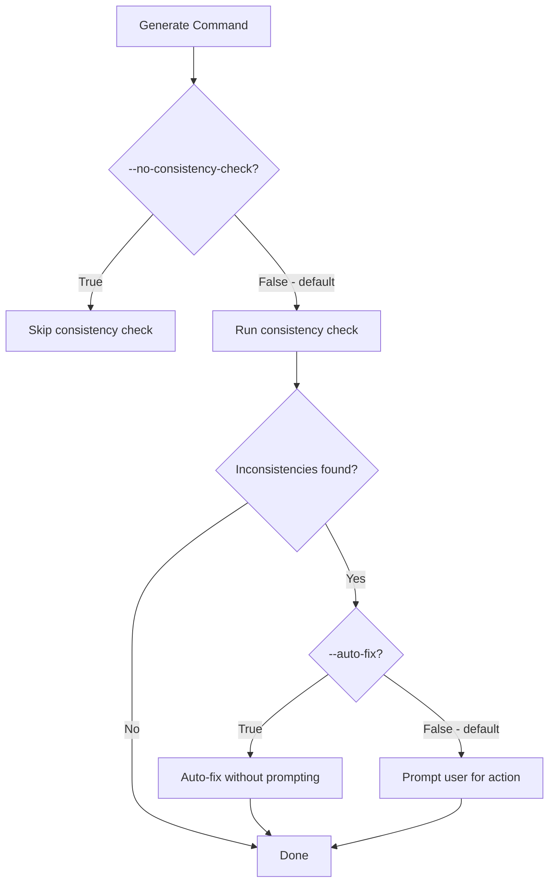

# CLI Flags Implementation Plan: --no-consistency-check and --auto-fix

## Overview

Add `--no-consistency-check` and `--auto-fix` flags to the `generate` command in the CLI to match the implementation plan specification.

## Current State Analysis

### Existing Implementation ([`specify/cli.py:963-967`](specify/cli.py:963))

```python
@click.option(
    "--consistency-check",
    is_flag=True,
    help="Run post-generation consistency check loop.",
)
```

**Current behavior:**

- `--consistency-check` flag: opt-IN to run consistency check
- Default: `False` (consistency check is NOT run)
- Logic: `if consistency_check: consistency_check_loop(output)`

### Plan Requirements ([`plans/implementation/implementation-plan.md:780-781`](plans/implementation/implementation-plan.md:780))

| Flag                     | Default | Description                                         |
| ------------------------ | ------- | --------------------------------------------------- |
| `--no-consistency-check` | False   | Skip post-generation consistency check prompt       |
| `--auto-fix`             | False   | Automatically fix inconsistencies without prompting |

**Plan behavior:**

- `--no-consistency-check` flag: opt-OUT to skip consistency check
- Default: `False` (consistency check IS run by default)
- This is **inverted semantics** from current implementation

## Implementation Details

### 1. Replace `--consistency-check` with `--no-consistency-check`

**File:** [`specify/cli.py`](specify/cli.py:963-967)

**Before:**

```python
@click.option(
    "--consistency-check",
    is_flag=True,
    help="Run post-generation consistency check loop.",
)
```

**After:**

```python
@click.option(
    "--no-consistency-check",
    is_flag=True,
    default=False,
    help="Skip post-generation consistency check prompt.",
)
```

### 2. Add `--auto-fix` Flag

**File:** [`specify/cli.py`](specify/cli.py) (after `--no-consistency-check` option)

```python
@click.option(
    "--auto-fix",
    is_flag=True,
    default=False,
    help="Automatically fix inconsistencies without prompting.",
)
```

### 3. Update Function Signature

**File:** [`specify/cli.py`](specify/cli.py:969-978)

**Before:**

```python
def generate(
    ctx: click.Context,
    prompt: str,
    doc_type: str,
    provider: str,
    output: str,
    model: str | None,
    no_recommendations: bool,
    consistency_check: bool,
) -> None:
```

**After:**

```python
def generate(
    ctx: click.Context,
    prompt: str,
    doc_type: str,
    provider: str,
    output: str,
    model: str | None,
    no_recommendations: bool,
    no_consistency_check: bool,
    auto_fix: bool,
) -> None:
```

### 4. Update Logic

**File:** [`specify/cli.py`](specify/cli.py:1017-1021)

**Before:**

```python
    # Run consistency check loop after generation only when explicitly requested
    # Default is to skip for backward compatibility (CLI usage)
    # Use --consistency-check flag to enable
    if consistency_check:
        consistency_check_loop(output)
```

**After:**

```python
    # Run consistency check loop after generation by default
    # Use --no-consistency-check flag to skip
    if not no_consistency_check:
        consistency_check_loop(output, auto_fix=auto_fix)
```

**Note:** The `consistency_check_loop` function signature may need to be updated to accept `auto_fix` parameter, but the actual implementation is a TODO placeholder per the anti-scope.

### 5. Tests to Add

**File:** [`tests/test_cli.py`](tests/test_cli.py)

Add the following tests in the `TestGenerateCommand` class:

```python
def test_generate_no_consistency_check_flag(self, cli_runner: CliRunner) -> None:
    """Test generate with --no-consistency-check flag."""
    result = cli_runner.invoke(
        cli,
        ["generate", "--prompt", "Build a task app", "--no-consistency-check"],
    )
    assert result.exit_code == 0

def test_generate_auto_fix_flag(self, cli_runner: CliRunner) -> None:
    """Test generate with --auto-fix flag."""
    result = cli_runner.invoke(
        cli,
        ["generate", "--prompt", "Build a task app", "--auto-fix"],
    )
    assert result.exit_code == 0

def test_generate_both_new_flags(self, cli_runner: CliRunner) -> None:
    """Test generate with both --no-consistency-check and --auto-fix flags."""
    result = cli_runner.invoke(
        cli,
        ["generate", "--prompt", "Build a task app", "--no-consistency-check", "--auto-fix"],
    )
    assert result.exit_code == 0

def test_generate_help_shows_new_flags(self, cli_runner: CliRunner) -> None:
    """Test that generate --help shows the new flags."""
    result = cli_runner.invoke(cli, ["generate", "--help"])
    assert result.exit_code == 0
    assert "--no-consistency-check" in result.output
    assert "--auto-fix" in result.output
    assert "Skip post-generation consistency check" in result.output
    assert "Automatically fix inconsistencies" in result.output
```

## Semantic Behavior Summary



## Acceptance Criteria Checklist

- [ ] `--no-consistency-check` flag added with correct Click decorator
- [ ] `--auto-fix` flag added with correct Click decorator
- [ ] Both flags have `default=False`
- [ ] Help text matches plan descriptions
- [ ] Function signature updated to accept new parameters
- [ ] Logic updated to run consistency check by default
- [ ] Tests added for new flags
- [ ] Existing tests still pass

## Anti-Scope Reminder

- Do NOT modify the actual consistency check logic implementation
- Do NOT change other commands or flags
