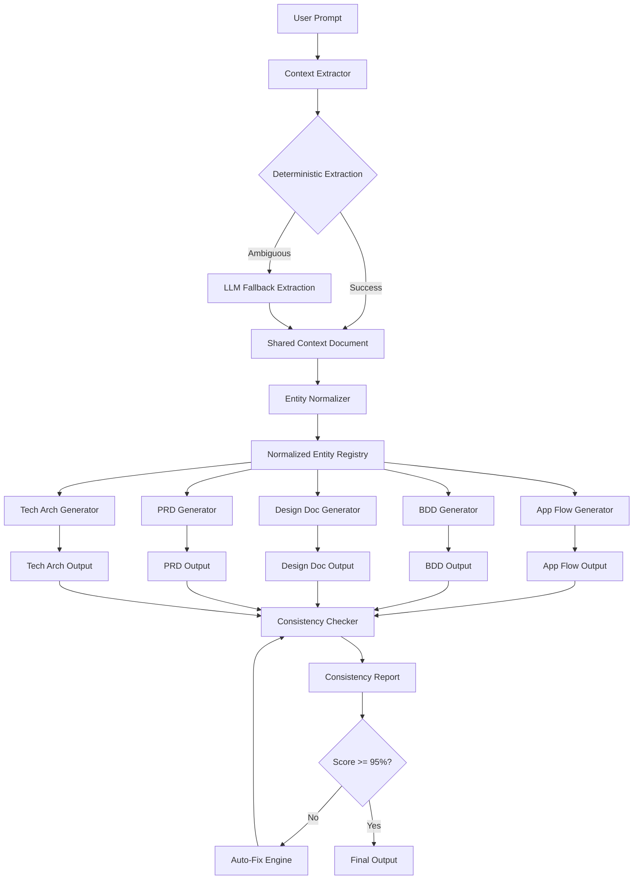

# Document Consistency Enhancement Plan

## Overview

This plan addresses the root causes of document inconsistency by implementing a proactive, multi-layered approach that ensures consistency **before** and **during** generation, rather than only detecting inconsistencies after generation.

### Problem Statement

The current implementation plan relies on post-generation consistency checking. This approach:

- Detects inconsistencies after they occur (reactive)
- Requires additional LLM calls to fix issues
- May introduce new inconsistencies during fixes
- Does not address the root cause: different interpretations of the same prompt

### Solution Approach

Implement a **Shared Context Pipeline** that:

1. Extracts entities once from the user prompt
2. Generates a shared context document
3. Passes this context to all 5 generators
4. Validates cross-document consistency rules
5. Scores consistency quantitatively

---

## Architecture Overview

### Enhanced Data Flow



### New Components

| Component               | Location                            | Purpose                            |
| ----------------------- | ----------------------------------- | ---------------------------------- |
| Context Extractor       | `specify/context/extractor.py`      | Extract entities from user prompt  |
| Entity Normalizer       | `specify/context/normalizer.py`     | Normalize and deduplicate entities |
| Shared Context Document | `specify/context/shared_context.py` | Data structure for shared context  |
| Entity Registry         | `specify/context/registry.py`       | Central entity storage and lookup  |
| Consistency Validator   | `specify/analysis/validator.py`     | Cross-document validation rules    |
| Consistency Scorer      | `specify/analysis/scorer.py`        | Quantitative consistency scoring   |
| Prompt Template Manager | `specify/prompts/templates.py`      | Standardized prompt templates      |

---

## Phase 1: Context Extractor and Shared Entities

### 1.1 Entity Types to Extract

```python
from enum import Enum
from pydantic import BaseModel, Field
from typing import Optional

class EntityType(str, Enum):
    USER_PERSONA = "user_persona"
    FEATURE = "feature"
    TECHNICAL_CONSTRAINT = "technical_constraint"
    SUCCESS_METRIC = "success_metric"
    NON_FUNCTIONAL_REQ = "non_functional_req"
    BUSINESS_GOAL = "business_goal"
    INTEGRATION = "integration"
    DATA_ENTITY = "data_entity"

class Entity(BaseModel):
    id: str = Field(..., description="Unique identifier for the entity")
    entity_type: EntityType
    name: str = Field(..., description="Normalized name")
    description: str = Field(..., description="Entity description")
    source_text: str = Field(..., description="Original text from prompt")
    confidence: float = Field(..., ge=0.0, le=1.0, description="Extraction confidence")
    aliases: list[str] = Field(default_factory=list, description="Alternative names found")

class UserPersonaEntity(Entity):
    entity_type: EntityType = EntityType.USER_PERSONA
    role: Optional[str] = None
    characteristics: list[str] = Field(default_factory=list)
    goals: list[str] = Field(default_factory=list)

class FeatureEntity(Entity):
    entity_type: EntityType = EntityType.FEATURE
    priority: Optional[str] = None  # must, should, could, wont
    dependencies: list[str] = Field(default_factory=list)
    user_stories: list[str] = Field(default_factory=list)

class TechnicalConstraintEntity(Entity):
    entity_type: EntityType = EntityType.TECHNICAL_CONSTRAINT
    constraint_type: str  # performance, security, budget, etc.
    value: str  # e.g., "< 2 seconds", "$500/month"
    unit: Optional[str] = None

class SuccessMetricEntity(Entity):
    entity_type: EntityType = EntityType.SUCCESS_METRIC
    metric_name: str
    target_value: str
    measurement_method: Optional[str] = None
```

### 1.2 Deterministic Entity Extraction

```python
# specify/context/extractor.py

import re
from typing import Optional
from pathlib import Path

class DeterministicExtractor:
    """
    Pattern-based entity extraction without LLM calls.
    Fast, deterministic, and free.
    """

    # Patterns for entity extraction
    PATTERNS = {
        "user_persona": [
            r"(?i)(?:user|customer|admin|manager|developer)\s+(?:named\s+)?['\"]?([A-Z][a-z]+)['\"]?",
            r"(?i)(?:as\s+a|for\s+(?:the\s+)?)\s*([a-z]+\s+(?:user|customer|admin|manager|developer))",
            r"(?i)(?:target\s+)?(?:audience|user)s?\s*(?:include|are|is|:)\s*([^.]+)",
        ],
        "feature": [
            r"(?i)(?:feature|functionality|capability)(?:\s+called|\s+named)?\s*['\"]?([a-zA-Z\s]+)['\"]?",
            r"(?i)(?:ability\s+to|allow\s+(?:users?\s+)?to|enable\s+(?:users?\s+)?to)\s+([^.]+)",
            r"(?i)(?:must|should|need\s+to)\s+(?:have\s+|include\s+|support\s+)?([^.]+)",
        ],
        "technical_constraint": [
            r"(?i)(?:latency|response\s+time)\s*(?:<|less\s+than|under|below)\s*(\d+\s*(?:ms|seconds?|s))",
            r"(?i)(?:budget|cost)\s*(?:<|less\s+than|under|below|max)\s*(\$?\d+(?:k|K|,)?(?:\s*(?:per\s+month|\/month|monthly))?)",
            r"(?i)(?:uptime|availability)\s*(?:>|greater\s+than|above|at\s+least)\s*(\d+(?:\.\d+)?%?)",
            r"(?i)(?:support|handle)\s*(\d+(?:,\d+)*(?:k|K|m|M)?)\s*(?:users?|requests?|transactions?)",
        ],
        "success_metric": [
            r"(?i)(?:KPI|metric|goal|target)\s*(?::|is)\s*([^.]+)",
            r"(?i)(?:increase|decrease|reduce|improve)\s+([^.]+?)\s+by\s+(\d+%)",
            r"(?i)(?:achieve|reach|hit)\s+(\d+(?:\.\d+)?%?)\s+([^.]+)",
        ],
    }

    def extract(self, prompt: str) -> list[Entity]:
        """Extract entities using pattern matching."""
        entities = []

        for entity_type, patterns in self.PATTERNS.items():
            for pattern in patterns:
                matches = re.finditer(pattern, prompt)
                for match in matches:
                    entity = self._create_entity(entity_type, match, prompt)
                    if entity:
                        entities.append(entity)

        return entities

    def _create_entity(
        self, entity_type: str, match: re.Match, prompt: str
    ) -> Optional[Entity]:
        """Create an entity from a regex match."""
        # Implementation details...
        pass
```

### 1.3 LLM Fallback for Ambiguity

```python
# specify/context/llm_extractor.py

from specify.providers.base import BaseProvider
from .models import Entity, EntityContext

LLM_EXTRACTION_PROMPT = """
You are an Entity Extraction Specialist. Extract the following entity types from the user prompt:

1. **User Personas**: Who are the users? Include roles, characteristics, goals.
2. **Features**: What features/capabilities are mentioned? Include priorities if stated.
3. **Technical Constraints**: Performance targets, budget limits, uptime requirements.
4. **Success Metrics**: KPIs, targets, measurement methods.
5. **Business Goals**: What outcomes does the business want?
6. **Integrations**: External systems, APIs, services mentioned.
7. **Data Entities**: Core data objects (users, orders, products, etc.)

For each entity, provide:
- Normalized name (consistent naming)
- Description
- Original text from prompt
- Confidence level (high/medium/low)

Output as JSON following this schema:
{schema}

USER PROMPT:
{prompt}
"""

class LLMEntityExtractor:
    """
    LLM-based entity extraction for ambiguous cases.
    Used when deterministic extraction yields low confidence or missing entities.
    """

    def __init__(self, provider: BaseProvider):
        self.provider = provider

    def extract(self, prompt: str, missing_types: list[str]) -> EntityContext:
        """
        Extract entities using LLM.
        Only called when deterministic extraction is insufficient.
        """
        extraction_prompt = LLM_EXTRACTION_PROMPT.format(
            schema=self._get_schema(),
            prompt=prompt
        )

        response = self.provider.generate(extraction_prompt)
        return self._parse_response(response)

    def _get_schema(self) -> str:
        """Return JSON schema for entity extraction."""
        # Implementation...
        pass

    def _parse_response(self, response: str) -> EntityContext:
        """Parse LLM response into EntityContext."""
        # Implementation...
        pass
```

### 1.4 Hybrid Context Extractor

```python
# specify/context/hybrid_extractor.py

from typing import Optional
from specify.providers.base import BaseProvider
from .deterministic import DeterministicExtractor
from .llm_extractor import LLMEntityExtractor
from .models import EntityContext

class HybridContextExtractor:
    """
    Hybrid entity extraction: deterministic first, LLM fallback for ambiguity.

    Decision tree:
    1. Run deterministic extraction
    2. Check confidence thresholds
    3. If any entity type is missing or low confidence, use LLM
    4. Merge results with priority to high-confidence extractions
    """

    CONFIDENCE_THRESHOLD = 0.7
    MIN_ENTITIES_PER_TYPE = {
        "user_persona": 1,
        "feature": 1,
        # Other types can be empty
    }

    def __init__(self, provider: Optional[BaseProvider] = None):
        self.deterministic = DeterministicExtractor()
        self.llm_extractor = LLMEntityExtractor(provider) if provider else None

    def extract(self, prompt: str) -> EntityContext:
        """
        Extract entities using hybrid approach.

        Args:
            prompt: User's product description

        Returns:
            EntityContext with all extracted entities
        """
        # Step 1: Deterministic extraction
        deterministic_entities = self.deterministic.extract(prompt)

        # Step 2: Analyze coverage and confidence
        analysis = self._analyze_extraction(deterministic_entities)

        # Step 3: Determine if LLM fallback needed
        if analysis.needs_llm_fallback and self.llm_extractor:
            llm_entities = self.llm_extractor.extract(
                prompt,
                analysis.missing_types
            )
            # Merge with priority to high-confidence deterministic results
            return self._merge_entities(deterministic_entities, llm_entities)

        return EntityContext(entities=deterministic_entities)

    def _analyze_extraction(self, entities: list[Entity]) -> "ExtractionAnalysis":
        """Analyze extraction results to determine if LLM fallback needed."""
        # Implementation...
        pass

    def _merge_entities(
        self,
        deterministic: list[Entity],
        llm: list[Entity]
    ) -> EntityContext:
        """Merge deterministic and LLM extractions."""
        # Implementation...
        pass
```

### 1.5 Shared Context Document

```python
# specify/context/shared_context.py

from pydantic import BaseModel, Field
from typing import Optional
from datetime import datetime

class SharedContextDocument(BaseModel):
    """
    Shared context document passed to all generators.
    Ensures consistent interpretation of user prompt.
    """

    # Metadata
    id: str = Field(default_factory=lambda: str(uuid.uuid4()))
    created_at: datetime = Field(default_factory=datetime.utcnow)
    source_prompt: str

    # Extracted Entities
    user_personas: list[UserPersonaEntity] = Field(default_factory=list)
    features: list[FeatureEntity] = Field(default_factory=list)
    technical_constraints: list[TechnicalConstraintEntity] = Field(default_factory=list)
    success_metrics: list[SuccessMetricEntity] = Field(default_factory=list)
    business_goals: list[Entity] = Field(default_factory=list)
    integrations: list[Entity] = Field(default_factory=list)
    data_entities: list[Entity] = Field(default_factory=list)

    # Derived Context
    product_name: Optional[str] = None
    product_type: Optional[str] = None  # web app, mobile app, API, etc.
    target_platform: list[str] = Field(default_factory=list)

    # Normalization Metadata
    entity_registry: dict[str, str] = Field(
        default_factory=dict,
        description="Maps original text to normalized entity IDs"
    )

    def to_prompt_section(self) -> str:
        """
        Generate a markdown section to include in generator prompts.
        This ensures all generators see the same context.
        """
        return f"""
## SHARED CONTEXT

The following context has been extracted from your prompt and should be used consistently across all documents.

### Product Overview
- **Product Name**: {self.product_name or 'Not specified'}
- **Product Type**: {self.product_type or 'Not specified'}
- **Target Platforms**: {', '.join(self.target_platform) or 'Not specified'}

### User Personas
{self._format_user_personas()}

### Features
{self._format_features()}

### Technical Constraints
{self._format_technical_constraints()}

### Success Metrics
{self._format_success_metrics()}

### Business Goals
{self._format_business_goals()}

### Integrations
{self._format_integrations()}

### Data Entities
{self._format_data_entities()}

---
*Use these normalized entity names consistently throughout your document.*
"""

    def _format_user_personas(self) -> str:
        if not self.user_personas:
            return "No user personas specified."
        lines = []
        for persona in self.user_personas:
            lines.append(f"- **{persona.name}** ({persona.role or 'User'})")
            if persona.characteristics:
                lines.append(f"  - Characteristics: {', '.join(persona.characteristics)}")
            if persona.goals:
                lines.append(f"  - Goals: {', '.join(persona.goals)}")
        return '\n'.join(lines)

    # Additional formatting methods...
```

---

## Phase 2: Entity Resolution Pipeline

### 2.1 Entity Normalizer

```python
# specify/context/normalizer.py

import re
from typing import Optional
from .models import Entity

class EntityNormalizer:
    """
    Normalizes entity names and descriptions for consistency.

    Rules:
    - Convert to lowercase
    - Replace spaces with underscores for IDs
    - Remove special characters
    - Standardize common terms
    """

    # Standard term mappings
    TERM_MAPPINGS = {
        "user": "user",
        "customer": "user",
        "end user": "user",
        "admin": "administrator",
        "administrator": "administrator",
        "admin user": "administrator",
        # Add more mappings as needed
    }

    def normalize_name(self, name: str) -> str:
        """Normalize entity name to consistent format."""
        # Lowercase
        name = name.lower().strip()

        # Apply term mappings
        name = self.TERM_MAPPINGS.get(name, name)

        # Convert to title case for display
        return name.title()

    def generate_id(self, name: str, entity_type: str) -> str:
        """Generate a unique, consistent ID for an entity."""
        normalized = name.lower().strip()
        normalized = re.sub(r'[^a-z0-9\s]', '', normalized)
        normalized = re.sub(r'\s+', '_', normalized)
        return f"{entity_type}_{normalized}"

    def normalize_entity(self, entity: Entity) -> Entity:
        """Normalize an entity in place."""
        entity.name = self.normalize_name(entity.name)
        entity.id = self.generate_id(entity.name, entity.entity_type.value)
        return entity
```

### 2.2 Entity Registry

```python
# specify/context/registry.py

from typing import Optional
from collections import defaultdict
from .models import Entity, EntityType

class EntityRegistry:
    """
    Central registry for all extracted entities.
    Provides lookup, deduplication, and relationship tracking.
    """

    def __init__(self):
        self._entities: dict[str, Entity] = {}
        self._by_type: dict[EntityType, list[str]] = defaultdict(list)
        self._aliases: dict[str, str] = {}  # alias -> entity_id
        self._relationships: dict[str, list[str]] = defaultdict(list)

    def register(self, entity: Entity) -> str:
        """Register an entity and return its ID."""
        # Check for duplicates
        existing = self._find_duplicate(entity)
        if existing:
            return existing.id

        # Register new entity
        self._entities[entity.id] = entity
        self._by_type[entity.entity_type].append(entity.id)

        # Register aliases
        for alias in entity.aliases:
            self._aliases[alias.lower()] = entity.id

        return entity.id

    def get(self, entity_id: str) -> Optional[Entity]:
        """Get entity by ID."""
        return self._entities.get(entity_id)

    def get_by_name(self, name: str) -> Optional[Entity]:
        """Get entity by name or alias."""
        # Try exact match first
        name_lower = name.lower()
        for entity in self._entities.values():
            if entity.name.lower() == name_lower:
                return entity

        # Try aliases
        entity_id = self._aliases.get(name_lower)
        if entity_id:
            return self._entities.get(entity_id)

        return None

    def get_by_type(self, entity_type: EntityType) -> list[Entity]:
        """Get all entities of a specific type."""
        return [
            self._entities[eid]
            for eid in self._by_type.get(entity_type, [])
        ]

    def add_relationship(self, entity1_id: str, entity2_id: str):
        """Record a relationship between two entities."""
        self._relationships[entity1_id].append(entity2_id)
        self._relationships[entity2_id].append(entity1_id)

    def get_related(self, entity_id: str) -> list[Entity]:
        """Get all entities related to the given entity."""
        related_ids = self._relationships.get(entity_id, [])
        return [self._entities[rid] for rid in related_ids if rid in self._entities]

    def _find_duplicate(self, entity: Entity) -> Optional[Entity]:
        """Check if a similar entity already exists."""
        # Check by ID
        if entity.id in self._entities:
            return self._entities[entity.id]

        # Check by name
        existing = self.get_by_name(entity.name)
        if existing and existing.entity_type == entity.entity_type:
            return existing

        return None
```

---

## Phase 3: Cross-Document Validation Rules

### 3.1 Validation Rule Definitions

```python
# specify/analysis/validation_rules.py

from abc import ABC, abstractmethod
from typing import list, Optional
from pydantic import BaseModel
from specify.context import SharedContextDocument

class ValidationSeverity(str, Enum):
    CRITICAL = "critical"  # Must be fixed before documents are usable
    HIGH = "high"          # Should be fixed for quality
    MEDIUM = "medium"      # Nice to have for consistency
    LOW = "low"            # Minor inconsistency

class ValidationResult(BaseModel):
    rule_id: str
    severity: ValidationSeverity
    message: str
    affected_documents: list[str]
    details: Optional[str] = None
    suggested_fix: Optional[str] = None

class ValidationRule(ABC):
    """Base class for cross-document validation rules."""

    @property
    @abstractmethod
    def rule_id(self) -> str:
        """Unique identifier for this rule."""
        pass

    @property
    @abstractmethod
    def description(self) -> str:
        """Human-readable description of what this rule checks."""
        pass

    @abstractmethod
    def validate(
        self,
        documents: dict[str, str],
        context: SharedContextDocument
    ) -> list[ValidationResult]:
        """
        Validate documents against this rule.

        Args:
            documents: Map of document type to document content
            context: Shared context document

        Returns:
            List of validation results (empty if valid)
        """
        pass


class UserPersonaConsistencyRule(ValidationRule):
    """
    Rule: User personas in App Flow must match those in PRD.

    Checks:
    - Same persona names used across documents
    - Consistent characteristics for each persona
    - Goals align with feature descriptions
    """

    @property
    def rule_id(self) -> str:
        return "USR-001"

    @property
    def description(self) -> str:
        return "User personas must be consistent across all documents"

    def validate(
        self,
        documents: dict[str, str],
        context: SharedContextDocument
    ) -> list[ValidationResult]:
        results = []

        # Get personas from shared context
        expected_personas = {p.name.lower() for p in context.user_personas}

        # Check each document for persona mentions
        for doc_type, content in documents.items():
            found_personas = self._extract_persona_names(content)
            missing = expected_personas - found_personas
            extra = found_personas - expected_personas

            if missing:
                results.append(ValidationResult(
                    rule_id=self.rule_id,
                    severity=ValidationSeverity.MEDIUM,
                    message=f"Document missing expected personas: {missing}",
                    affected_documents=[doc_type],
                    suggested_fix=f"Add references to: {', '.join(missing)}"
                ))

            if extra:
                results.append(ValidationResult(
                    rule_id=self.rule_id,
                    severity=ValidationSeverity.LOW,
                    message=f"Document contains undefined personas: {extra}",
                    affected_documents=[doc_type],
                    suggested_fix=f"Define these personas in the prompt or remove references"
                ))

        return results

    def _extract_persona_names(self, content: str) -> set[str]:
        """Extract persona names from document content."""
        # Implementation using NER or pattern matching
        pass


class FeatureConsistencyRule(ValidationRule):
    """
    Rule: Features mentioned in PRD must appear in App Flow.

    Checks:
    - All PRD features appear in App Flow
    - Feature priorities are consistent
    - Dependencies are documented in both PRD and Tech Arch
    """

    @property
    def rule_id(self) -> str:
        return "FTR-001"

    @property
    def description(self) -> str:
        return "Features must be consistent across PRD, App Flow, and Tech Arch"

    def validate(
        self,
        documents: dict[str, str],
        context: SharedContextDocument
    ) -> list[ValidationResult]:
        results = []

        # Get features from shared context
        expected_features = {f.name.lower(): f for f in context.features}

        prd_features = self._extract_features(documents.get("prd", ""))
        app_flow_features = self._extract_features(documents.get("app-flow", ""))
        tech_arch_features = self._extract_features(documents.get("tech-arch", ""))

        # Check PRD features appear in App Flow
        for feature in prd_features:
            if feature.lower() not in [f.lower() for f in app_flow_features]:
                results.append(ValidationResult(
                    rule_id=self.rule_id,
                    severity=ValidationSeverity.HIGH,
                    message=f"Feature '{feature}' from PRD not found in App Flow",
                    affected_documents=["prd", "app-flow"],
                    suggested_fix=f"Add user flow for '{feature}' to App Flow"
                ))

        # Check feature dependencies are documented
        for feature in context.features:
            if feature.dependencies:
                for dep in feature.dependencies:
                    if dep.lower() not in [f.lower() for f in tech_arch_features]:
                        results.append(ValidationResult(
                            rule_id=self.rule_id,
                            severity=ValidationSeverity.MEDIUM,
                            message=f"Dependency '{dep}' for '{feature.name}' not in Tech Arch",
                            affected_documents=["tech-arch"],
                            suggested_fix=f"Document technical implementation of '{dep}'"
                        ))

        return results

    def _extract_features(self, content: str) -> list[str]:
        """Extract feature names from document content."""
        # Implementation...
        pass


class TechnicalConstraintConsistencyRule(ValidationRule):
    """
    Rule: Performance targets in PRD must be achievable per Tech Arch.

    Checks:
    - Latency targets have corresponding architecture decisions
    - Security requirements are reflected in Tech Arch
    - Data storage requirements match both Design Doc and Tech Arch
    """

    @property
    def rule_id(self) -> str:
        return "TECH-001"

    @property
    def description(self) -> str:
        return "Technical constraints must be addressed in architecture"

    def validate(
        self,
        documents: dict[str, str],
        context: SharedContextDocument
    ) -> list[ValidationResult]:
        results = []

        for constraint in context.technical_constraints:
            # Check if constraint is addressed in Tech Arch
            tech_arch = documents.get("tech-arch", "")
            if not self._is_addressed(constraint, tech_arch):
                results.append(ValidationResult(
                    rule_id=self.rule_id,
                    severity=ValidationSeverity.HIGH,
                    message=f"Technical constraint '{constraint.name}' not addressed in Tech Arch",
                    affected_documents=["tech-arch"],
                    suggested_fix=f"Add architecture decision for: {constraint.description}"
                ))

        return results

    def _is_addressed(self, constraint, tech_arch: str) -> bool:
        """Check if a constraint is addressed in the architecture."""
        # Implementation...
        pass


class SuccessMetricConsistencyRule(ValidationRule):
    """
    Rule: KPIs in PRD must be measurable and tracked.

    Checks:
    - KPIs are measurable (have numeric targets)
    - KPIs in App Flow track user actions that contribute to KPIs
    - Tech Arch provides technical paths to achieve KPIs
    """

    @property
    def rule_id(self) -> str:
        return "KPI-001"

    @property
    def description(self) -> str:
        return "Success metrics must be measurable and traceable"

    def validate(
        self,
        documents: dict[str, str],
        context: SharedContextDocument
    ) -> list[ValidationResult]:
        results = []

        for metric in context.success_metrics:
            # Check measurability
            if not metric.target_value:
                results.append(ValidationResult(
                    rule_id=self.rule_id,
                    severity=ValidationSeverity.MEDIUM,
                    message=f"Success metric '{metric.name}' has no target value",
                    affected_documents=["prd"],
                    suggested_fix=f"Define a measurable target for '{metric.name}'"
                ))

            # Check if tracked in App Flow
            app_flow = documents.get("app-flow", "")
            if not self._is_tracked(metric, app_flow):
                results.append(ValidationResult(
                    rule_id=self.rule_id,
                    severity=ValidationSeverity.LOW,
                    message=f"Metric '{metric.name}' not tracked in App Flow",
                    affected_documents=["app-flow"],
                    suggested_fix=f"Add tracking events for '{metric.name}'"
                ))

        return results

    def _is_tracked(self, metric, app_flow: str) -> bool:
        """Check if a metric is tracked in the app flow."""
        # Implementation...
        pass
```

### 3.2 Validation Rule Registry

```python
# specify/analysis/validator.py

from typing import list
from .validation_rules import ValidationRule, ValidationResult
from specify.context import SharedContextDocument

class ValidationRuleRegistry:
    """Registry of all validation rules."""

    def __init__(self):
        self._rules: list[ValidationRule] = []

    def register(self, rule: ValidationRule):
        """Register a validation rule."""
        self._rules.append(rule)

    def get_all_rules(self) -> list[ValidationRule]:
        """Get all registered rules."""
        return self._rules.copy()


class CrossDocumentValidator:
    """
    Validates consistency across all generated documents.
    """

    def __init__(self):
        self.registry = ValidationRuleRegistry()
        self._register_default_rules()

    def _register_default_rules(self):
        """Register all default validation rules."""
        self.registry.register(UserPersonaConsistencyRule())
        self.registry.register(FeatureConsistencyRule())
        self.registry.register(TechnicalConstraintConsistencyRule())
        self.registry.register(SuccessMetricConsistencyRule())

    def validate(
        self,
        documents: dict[str, str],
        context: SharedContextDocument
    ) -> list[ValidationResult]:
        """
        Run all validation rules against the documents.

        Args:
            documents: Map of document type to content
            context: Shared context document

        Returns:
            List of all validation results
        """
        all_results = []

        for rule in self.registry.get_all_rules():
            results = rule.validate(documents, context)
            all_results.extend(results)

        return all_results

    def validate_and_sort(
        self,
        documents: dict[str, str],
        context: SharedContextDocument
    ) -> dict[ValidationSeverity, list[ValidationResult]]:
        """
        Validate and return results grouped by severity.
        """
        results = self.validate(documents, context)

        sorted_results = {severity: [] for severity in ValidationSeverity}
        for result in results:
            sorted_results[result.severity].append(result)

        return sorted_results
```

---

## Phase 4: Prompt Template Standardization

### 4.1 Standardized Prompt Template

```python
# specify/prompts/templates.py

from string import Template
from typing import Optional
from specify.context import SharedContextDocument

SYSTEM_PROMPT_TEMPLATE = Template("""
# ROLE & IDENTITY

$role_definition

---

# CORE MISSION

$mission_statement

---

# OPERATING RULES (NON-NEGOTIABLE)

$operating_rules

---

# CONTEXT FROM USER PROMPT

$user_context

---

# SHARED ENTITIES (from Context Extractor)

$shared_entities

---

# DOCUMENT STRUCTURE REQUIREMENTS

$document_structure

---

# OUTPUT FORMAT LOCK

$output_format

---

# CONSISTENCY REQUIREMENTS

1. Use the exact entity names provided in the Shared Entities section
2. Reference the same features, user personas, and constraints across all mentions
3. Align your output with the shared context - do not introduce conflicting information
4. If you need to add new entities, clearly mark them as [NEW] in your output
5. Cross-reference other documents when appropriate (e.g., "As defined in the PRD...")

---

# FEW-SHOT EXAMPLES

$few_shot_examples
""")

class PromptTemplateManager:
    """
    Manages standardized prompt templates for all document types.
    """

    DOCUMENT_CONFIGS = {
        "app-flow": {
            "role_definition": "You are **App Flow Architect**, a world-class UX designer...",
            "mission_statement": "Generate comprehensive user flow documentation...",
            "operating_rules": "1. Start with entry points...",
            # ... more config
        },
        "bdd": {
            "role_definition": "You are **Backend Design Architect**, a world-class...",
            "mission_statement": "Generate comprehensive backend design documentation...",
            # ... more config
        },
        # ... other document types
    }

    def __init__(self, rules_dir: str = "plans/rules"):
        self.rules_dir = rules_dir
        self._loaded_rules: dict[str, str] = {}

    def generate_prompt(
        self,
        document_type: str,
        user_prompt: str,
        shared_context: SharedContextDocument
    ) -> str:
        """
        Generate a complete system prompt for a document type.

        Args:
            document_type: Type of document to generate
            user_prompt: Original user prompt
            shared_context: Extracted shared context

        Returns:
            Complete system prompt string
        """
        config = self.DOCUMENT_CONFIGS.get(document_type, {})
        rules = self._load_rules(document_type)
        examples = self._load_examples(document_type)

        return SYSTEM_PROMPT_TEMPLATE.substitute(
            role_definition=config.get("role_definition", ""),
            mission_statement=config.get("mission_statement", ""),
            operating_rules=rules,
            user_context=user_prompt,
            shared_entities=shared_context.to_prompt_section(),
            document_structure=config.get("document_structure", ""),
            output_format=config.get("output_format", ""),
            few_shot_examples=examples
        )

    def _load_rules(self, document_type: str) -> str:
        """Load rules from the rules file for this document type."""
        if document_type not in self._loaded_rules:
            rule_file = f"{self.rules_dir}/{document_type}.md"
            # Load and cache rules
            # Implementation...
            pass
        return self._loaded_rules.get(document_type, "")

    def _load_examples(self, document_type: str) -> str:
        """Load few-shot examples for this document type."""
        # Load from embedded short examples + separate full examples
        # Implementation...
        pass
```

### 4.2 Rule File Enhancement

Each rule file should be enhanced with a new section for embedded short examples:

````markdown
# plans/rules/prd.md (enhanced)

[Existing content...]

---

# FEW-SHOT EXAMPLES

## Short Example 1: Feature Prioritization

**Input:** "Build a task management app with collaboration features"

**Correct Output:**

```markdown
### Feature Prioritization

| Priority | Feature             | Rationale                                           |
| -------- | ------------------- | --------------------------------------------------- |
| P0       | Task CRUD           | Core functionality - without this, app has no value |
| P0       | User Authentication | Required for personal task lists                    |
| P1       | Team Collaboration  | Differentiates from simple todo apps                |
| P2       | Real-time Updates   | Nice-to-have, can use polling initially             |
```
````

**Why this is correct:**

- Uses MoSCoW-style prioritization
- Clear rationale for each priority
- Aligns with lean MVP bias

## Short Example 2: Success Metrics

**Input:** "Users should be able to complete tasks quickly"

**Correct Output:**

```markdown
### Success Metrics

| Metric               | Target              | Measurement Method                            |
| -------------------- | ------------------- | --------------------------------------------- |
| Task Completion Time | < 30 seconds        | Analytics tracking from task open to complete |
| Daily Active Users   | 1000 within 30 days | User authentication logs                      |
| Task Completion Rate | > 80%               | Completed tasks / Total created tasks         |
```

**Why this is correct:**

- Replaces vague "quickly" with measurable target
- Includes measurement method
- Multiple metrics for comprehensive tracking

---

# COMMON PATTERNS

Always include:

- North Star metric aligned with business goal
- At least 3 success metrics
- Clear measurement methods for each metric

```

---

## Phase 5: Few-Shot Examples Implementation

### 5.1 Directory Structure

```

plans/
├── rules/
│ ├── app-flow-doc.md # Enhanced with embedded short examples
│ ├── bdd.md # Enhanced with embedded short examples
│ ├── design-doc.md # Enhanced with embedded short examples
│ ├── prd.md # Enhanced with embedded short examples
│ └── technical-architecture-doc.md
│
└── examples/
├── app-flow/
│ ├── ride-sharing-app.md
│ ├── task-management-app.md
│ └── e-commerce-app.md
├── bdd/
│ └── ...
├── design-doc/
│ └── ...
├── prd/
│ └── ...
└── tech-arch/
└── ...

````

### 5.2 Example File Format

```markdown
# plans/examples/prd/ride-sharing-app.md

# Example: Ride-Sharing App PRD

## Input Prompt

"Build a ride-sharing app like Uber but for pet owners. Users should be able to
book rides that accommodate their pets. Drivers can opt-in to accept pets."

## Expected Output

[Full PRD document following the exact structure...]

## Key Consistency Points

This example demonstrates:
1. **User Persona Consistency**: "Pet Owner" and "Pet-Friendly Driver" personas
   are defined once and referenced throughout
2. **Feature Naming**: "Pet Profile", "Pet-Friendly Ride Request", "Driver Pet Opt-In"
   are used consistently
3. **Technical Constraints**: "Location accuracy < 10m" is referenced in both
   PRD and would appear in Tech Arch
4. **Success Metrics**: "Pet ride completion rate > 95%" is measurable

## Entity Registry

| Entity Type | Normalized Name | Original Text |
|-------------|-----------------|---------------|
| user_persona | Pet Owner | "pet owners", "users with pets" |
| user_persona | Pet-Friendly Driver | "drivers who accept pets" |
| feature | Pet Profile | "pet profiles", "pet information" |
| feature | Pet-Friendly Ride Request | "book rides for pets" |
| technical_constraint | Location Accuracy | "accurate location" |
| success_metric | Pet Ride Completion Rate | "successful pet rides" |
````

---

## Phase 6: Consistency Scoring Algorithm

### 6.1 Scoring Implementation

```python
# specify/analysis/scorer.py

from typing import dict
from dataclasses import dataclass
from specify.context import SharedContextDocument

@dataclass
class ConsistencyScore:
    """Represents a consistency score with breakdown."""

    overall_score: float  # 0.0 to 1.0
    entity_overlap_score: float
    terminology_score: float
    structure_score: float
    cross_reference_score: float

    # Detailed breakdown
    entity_matches: dict[str, list[str]]  # entity_id -> documents where found
    terminology_issues: list[dict]
    structure_issues: list[dict]
    missing_cross_references: list[dict]

class ConsistencyScorer:
    """
    Scores consistency between generated documents.

    Scoring weights:
    - Entity overlap: 40%
    - Terminology consistency: 25%
    - Structure similarity: 20%
    - Cross-referencing accuracy: 15%
    """

    WEIGHTS = {
        "entity_overlap": 0.40,
        "terminology": 0.25,
        "structure": 0.20,
        "cross_reference": 0.15,
    }

    def calculate_consistency_score(
        self,
        documents: dict[str, str],
        context: SharedContextDocument
    ) -> ConsistencyScore:
        """
        Calculate overall consistency score.

        Args:
            documents: Map of document type to content
            context: Shared context with expected entities

        Returns:
            ConsistencyScore with detailed breakdown
        """
        # Calculate individual scores
        entity_score, entity_matches = self._score_entity_overlap(documents, context)
        term_score, term_issues = self._score_terminology(documents, context)
        struct_score, struct_issues = self._score_structure(documents)
        xref_score, xref_issues = self._score_cross_references(documents, context)

        # Calculate weighted overall score
        overall = (
            entity_score * self.WEIGHTS["entity_overlap"] +
            term_score * self.WEIGHTS["terminology"] +
            struct_score * self.WEIGHTS["structure"] +
            xref_score * self.WEIGHTS["cross_reference"]
        )

        return ConsistencyScore(
            overall_score=overall,
            entity_overlap_score=entity_score,
            terminology_score=term_score,
            structure_score=struct_score,
            cross_reference_score=xref_score,
            entity_matches=entity_matches,
            terminology_issues=term_issues,
            structure_issues=struct_issues,
            missing_cross_references=xref_issues
        )

    def _score_entity_overlap(
        self,
        documents: dict[str, str],
        context: SharedContextDocument
    ) -> tuple[float, dict[str, list[str]]]:
        """
        Score how well entities appear across all documents.

        Perfect score: All entities appear in all relevant documents.
        """
        entity_matches = {}
        total_expected = 0
        total_found = 0

        # Check each entity
        all_entities = (
            context.user_personas +
            context.features +
            context.technical_constraints +
            context.success_metrics
        )

        for entity in all_entities:
            entity_matches[entity.id] = []
            docs_where_expected = self._get_expected_documents(entity)
            total_expected += len(docs_where_expected)

            for doc_type in docs_where_expected:
                if doc_type in documents:
                    if self._entity_in_document(entity, documents[doc_type]):
                        entity_matches[entity.id].append(doc_type)
                        total_found += 1

        score = total_found / total_expected if total_expected > 0 else 1.0
        return score, entity_matches

    def _score_terminology(
        self,
        documents: dict[str, str],
        context: SharedContextDocument
    ) -> tuple[float, list[dict]]:
        """
        Score terminology consistency.

        Checks:
        - Same entity names used across documents
        - No conflicting terms for the same concept
        """
        issues = []
        total_checks = 0
        passed_checks = 0

        # Check for consistent naming
        for entity in context.features:
            # Get all variations of this entity's name
            expected_names = [entity.name] + entity.aliases

            for doc_type, content in documents.items():
                total_checks += 1
                found_names = self._extract_entity_names(content, expected_names)

                if found_names and len(set(found_names)) > 1:
                    issues.append({
                        "entity": entity.name,
                        "document": doc_type,
                        "issue": f"Multiple names used: {found_names}",
                        "expected": entity.name
                    })
                elif found_names:
                    passed_checks += 1

        score = passed_checks / total_checks if total_checks > 0 else 1.0
        return score, issues

    def _score_structure(self, documents: dict[str, str]) -> tuple[float, list[dict]]:
        """
        Score structural consistency.

        Checks:
        - All required sections present
        - Consistent heading hierarchy
        - Proper markdown formatting
        """
        issues = []
        total_checks = 0
        passed_checks = 0

        # Define required sections per document type
        required_sections = {
            "prd": ["Executive Summary", "Problem Definition", "Features", "Success Metrics"],
            "app-flow": ["User Flows", "Entry Points", "Screens", "Navigation"],
            "tech-arch": ["Architecture Overview", "Components", "Data Flow", "Security"],
            # ... other document types
        }

        for doc_type, content in documents.items():
            required = required_sections.get(doc_type, [])
            for section in required:
                total_checks += 1
                if self._section_present(content, section):
                    passed_checks += 1
                else:
                    issues.append({
                        "document": doc_type,
                        "issue": f"Missing required section: {section}"
                    })

        score = passed_checks / total_checks if total_checks > 0 else 1.0
        return score, issues

    def _score_cross_references(
        self,
        documents: dict[str, str],
        context: SharedContextDocument
    ) -> tuple[float, list[dict]]:
        """
        Score cross-document referencing accuracy.

        Checks:
        - Features in PRD reference App Flow sections
        - Technical decisions in Tech Arch reference PRD requirements
        """
        issues = []
        total_expected = 0
        total_found = 0

        # Check PRD -> App Flow references
        prd = documents.get("prd", "")
        app_flow = documents.get("app-flow", "")

        for feature in context.features:
            if feature.name in prd:
                total_expected += 1
                if feature.name in app_flow:
                    total_found += 1
                else:
                    issues.append({
                        "type": "missing_reference",
                        "source": "prd",
                        "target": "app-flow",
                        "entity": feature.name,
                        "issue": f"Feature '{feature.name}' in PRD not found in App Flow"
                    })

        score = total_found / total_expected if total_expected > 0 else 1.0
        return score, issues

    # Helper methods...
    def _get_expected_documents(self, entity) -> list[str]:
        """Determine which documents should contain this entity."""
        # Implementation based on entity type
        pass

    def _entity_in_document(self, entity, content: str) -> bool:
        """Check if entity appears in document content."""
        # Implementation...
        pass

    def _extract_entity_names(self, content: str, expected_names: list[str]) -> list[str]:
        """Extract all variations of entity names found in content."""
        # Implementation...
        pass

    def _section_present(self, content: str, section: str) -> bool:
        """Check if a section heading is present in content."""
        # Implementation...
        pass
```

### 6.2 Consistency Report Generation

```python
# specify/analysis/report.py

from typing import list
from .scorer import ConsistencyScore
from .validator import ValidationResult, ValidationSeverity

class ConsistencyReport:
    """
    Generates human-readable consistency reports.
    """

    def generate(
        self,
        score: ConsistencyScore,
        validation_results: list[ValidationResult]
    ) -> str:
        """Generate a markdown consistency report."""

        report = f"""
# Document Consistency Report

## Overall Score: {self._format_score(score.overall_score)}

| Category | Score | Weight |
|----------|-------|--------|
| Entity Overlap | {self._format_score(score.entity_overlap_score)} | 40% |
| Terminology | {self._format_score(score.terminology_score)} | 25% |
| Structure | {self._format_score(score.structure_score)} | 20% |
| Cross-References | {self._format_score(score.cross_reference_score)} | 15% |

## Validation Issues

{self._format_validation_issues(validation_results)}

## Entity Coverage

{self._format_entity_coverage(score.entity_matches)}

## Recommendations

{self._generate_recommendations(score, validation_results)}
"""
        return report

    def _format_score(self, score: float) -> str:
        """Format score with color indicator."""
        if score >= 0.95:
            return f"✅ {score:.1%}"
        elif score >= 0.80:
            return f"⚠️ {score:.1%}"
        else:
            return f"❌ {score:.1%}"

    def _format_validation_issues(
        self,
        results: list[ValidationResult]
    ) -> str:
        """Format validation issues by severity."""
        if not results:
            return "No validation issues found."

        lines = []
        for severity in [ValidationSeverity.CRITICAL, ValidationSeverity.HIGH,
                         ValidationSeverity.MEDIUM, ValidationSeverity.LOW]:
            issues = [r for r in results if r.severity == severity]
            if issues:
                lines.append(f"\n### {severity.value.upper()}\n")
                for issue in issues:
                    lines.append(f"- [{issue.rule_id}] {issue.message}")
                    if issue.suggested_fix:
                        lines.append(f"  - Fix: {issue.suggested_fix}")

        return '\n'.join(lines)

    def _format_entity_coverage(self, entity_matches: dict) -> str:
        """Format entity coverage table."""
        lines = ["| Entity | Documents Found |", "|--------|----------------|"]
        for entity_id, docs in entity_matches.items():
            lines.append(f"| {entity_id} | {', '.join(docs) or 'None'} |")
        return '\n'.join(lines)

    def _generate_recommendations(
        self,
        score: ConsistencyScore,
        results: list[ValidationResult]
    ) -> str:
        """Generate actionable recommendations."""
        recommendations = []

        if score.overall_score < 0.95:
            recommendations.append("1. Review and fix HIGH severity issues first")

        if score.entity_overlap_score < 0.90:
            recommendations.append("2. Ensure all entities are mentioned in relevant documents")

        if score.terminology_score < 0.90:
            recommendations.append("3. Standardize entity naming across all documents")

        if not recommendations:
            recommendations.append("Documents are consistent. No action needed.")

        return '\n'.join(recommendations)
```

---

## Implementation Priority

### Phase 2 (Current Sprint)

- [ ] Implement Context Extractor (hybrid approach)
- [ ] Implement Entity Normalizer
- [ ] Implement Shared Context Document
- [ ] Update generators to use shared context

### Phase 3

- [ ] Implement Entity Registry
- [ ] Implement Cross-Document Validation Rules
- [ ] Integrate validation into generation flow

### Phase 4

- [ ] Implement Consistency Scorer
- [ ] Implement Consistency Report Generator
- [ ] Add auto-fix capabilities

### Phase 5

- [ ] Enhance rule files with embedded short examples
- [ ] Create separate full document examples
- [ ] Implement example loading in Prompt Template Manager

---

## Expected Impact

| Metric                       | Current Approach | Enhanced Approach | Improvement |
| ---------------------------- | ---------------- | ----------------- | ----------- |
| Document Consistency Score   | ~70% (estimated) | 95%+ target       | +25%        |
| Post-generation fixes needed | High             | Low               | -80%        |
| Entity naming conflicts      | Common           | Rare              | -90%        |
| Cross-document references    | Manual           | Automatic         | N/A         |
| User intervention required   | Multiple steps   | Single approval   | -60%        |

---

## Testing Strategy

### Unit Tests

- Test each entity extraction pattern
- Test entity normalization rules
- Test validation rules in isolation
- Test scoring algorithm components

### Integration Tests

- Test full extraction pipeline
- Test validation with sample documents
- Test scoring with known-good document sets

### Quality Tests

- Generate documents from test prompts
- Verify consistency scores meet 95% threshold
- Validate all entities appear in expected documents

---

## File Structure Summary

```
specify/
├── context/                      # NEW: Context extraction module
│   ├── __init__.py
│   ├── extractor.py              # HybridContextExtractor
│   ├── deterministic.py          # DeterministicExtractor
│   ├── llm_extractor.py          # LLMEntityExtractor
│   ├── normalizer.py             # EntityNormalizer
│   ├── registry.py               # EntityRegistry
│   ├── shared_context.py         # SharedContextDocument
│   └── models.py                 # Entity Pydantic models
│
├── analysis/                     # ENHANCED: Analysis module
│   ├── __init__.py
│   ├── consistency.py            # Existing consistency checker
│   ├── validator.py              # NEW: CrossDocumentValidator
│   ├── validation_rules.py       # NEW: Validation rules
│   ├── scorer.py                 # NEW: ConsistencyScorer
│   └── report.py                 # NEW: ConsistencyReport
│
├── prompts/                      # NEW: Prompt management
│   ├── __init__.py
│   └── templates.py              # PromptTemplateManager
│
└── generators/                   # ENHANCED: Use shared context
    └── ...

plans/
├── rules/                        # ENHANCED: Add few-shot examples
│   └── *.md
│
└── examples/                     # NEW: Full document examples
    ├── app-flow/
    ├── bdd/
    ├── design-doc/
    ├── prd/
    └── tech-arch/
```

---

## Next Steps

1. Review and approve this plan
2. Switch to Code mode for implementation
3. Begin with Phase 2 (Context Extractor and Shared Entities)
4. Write tests alongside implementation
5. Update implementation-plan.md to reference this enhancement
