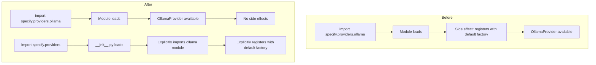

# Explicit Provider Registration Refactoring Plan

## Problem Statement

The current implementation has module-level side effects that complicate unit testing:

**Current problematic code in [`ollama.py:214`](specify/providers/ollama.py:214):**

```python
# Register the Ollama provider with the default factory
get_default_factory().register("ollama", OllamaProvider)
```

This line executes whenever `specify.providers.ollama` is imported, causing:

1. **Test contamination**: Tests that import `OllamaProvider` directly trigger registration with the global default factory
2. **Violation of PEP 20**: "Explicit is better than implicit" - registration happens implicitly as a side effect
3. **Difficulty testing in isolation**: Cannot create clean `ProviderFactory` instances without contamination

## Proposed Solution

Move registration from the submodule to the package `__init__.py`, making registration explicit rather than implicit.

### Import Behavior After Refactoring

| Import Statement                                      | Registration Happens? | Reason                                     |
| ----------------------------------------------------- | --------------------- | ------------------------------------------ |
| `import specify.providers.ollama`                     | No                    | Submodule has no side effects              |
| `from specify.providers.ollama import OllamaProvider` | No                    | Submodule has no side effects              |
| `import specify.providers`                            | Yes                   | Package `__init__.py` explicitly registers |
| `from specify.providers import OllamaProvider`        | Yes                   | Triggers `__init__.py` which registers     |

## Architecture Diagram



## Implementation Details

### 1. Modify `specify/providers/ollama.py`

**Remove line 214:**

```python
# DELETE THIS LINE:
get_default_factory().register("ollama", OllamaProvider)
```

The file should end after the `_handle_error` method with no module-level registration code.

### 2. Modify `specify/providers/__init__.py`

**Add explicit registration after the import:**

```python
from specify.providers.ollama import OllamaProvider

# Explicitly register providers with the default factory
get_default_factory().register("ollama", OllamaProvider)

__all__ = [
    # ... existing exports
]
```

### 3. Update `tests/test_providers/test_ollama.py`

The existing test at lines 286-289 should still pass:

```python
def test_provider_registered_on_import(self):
    """Test that OllamaProvider is registered on import."""
    factory = get_default_factory()
    assert factory.is_registered("ollama")
```

This works because the test file imports from `specify.providers` (line 21), which triggers `__init__.py`.

**Add new test for submodule import isolation:**

```python
def test_submodule_import_no_side_effects(self):
    """Test that importing ollama submodule directly does not register provider."""
    # This test verifies the fix for implicit registration
    # Create a fresh factory to verify no contamination
    from specify.providers.base import ProviderFactory
    fresh_factory = ProviderFactory()
    assert not fresh_factory.is_registered("ollama")
```

### 4. Update `plans/sprint3b-ollama-provider-implementation-plan.md`

Update Section 4 (lines 95-102) to reflect the new pattern:

**Before:**

````markdown
### 4. Factory Registration

Register OllamaProvider with the default factory on module import:

```python
# At module level in ollama.py
get_default_factory().register("ollama", OllamaProvider)
```
````

````

**After:**
```markdown
### 4. Factory Registration

Register OllamaProvider with the default factory explicitly in the package `__init__.py`:

```python
# In specify/providers/__init__.py
from specify.providers.ollama import OllamaProvider

# Explicitly register providers with the default factory
get_default_factory().register("ollama", OllamaProvider)
````

This pattern avoids import-time side effects when importing the submodule directly,
following PEP 20: "Explicit is better than implicit". Tests can import OllamaProvider
without triggering registration with the global factory.

```

## Acceptance Criteria

- [ ] `import specify.providers.ollama` does NOT register the provider with the default factory
- [ ] `import specify.providers` DOES register all providers
- [ ] Existing tests pass after the change
- [ ] Tests can create isolated `ProviderFactory` instances without contamination
- [ ] Implementation plan updated to reflect the new pattern

## Files to Modify

| File | Change |
|------|--------|
| `specify/providers/ollama.py` | Remove line 214 (module-level registration) |
| `specify/providers/__init__.py` | Add explicit registration after import |
| `tests/test_providers/test_ollama.py` | Add test for submodule import isolation |
| `plans/sprint3b-ollama-provider-implementation-plan.md` | Update Section 4 with new pattern |

## Anti-Scope

- Do NOT modify `specify/providers/base.py` - the factory implementation is correct
- Do NOT change the `OllamaProvider` class implementation itself
- Do NOT modify other provider implementations (none exist yet)
```
