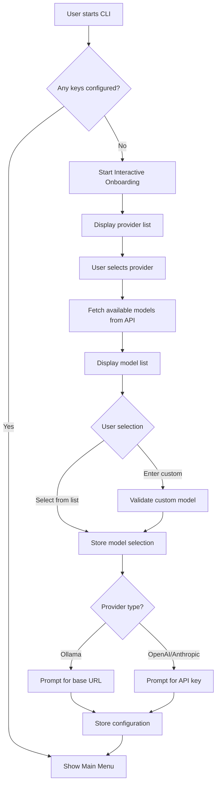
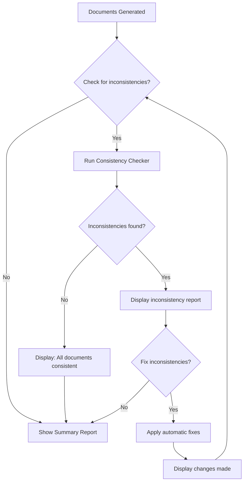

# IMPLEMENTATION PLAN: Specify.AI

## ━━━━━━━━━━━━━━━━━━━━━━━━━━━━━━━━━━━━━━━━━━━━━━━

---

### 🔖 ASSUMPTIONS

> The following assumptions were made based on user input and industry best practices:

1. **Target platform is CLI-only for MVP** — GUI is explicitly out of scope for v1, planned for future release.
2. **Team size is solo developer with AI assistance** — Architecture must be simple enough for one person to maintain.
3. **Local-first with BYOK (Bring Your Own Key)** — Users provide their own API keys; no centralized auth or billing needed.
4. **MVP supports Ollama as primary LLM provider** — OpenAI and Anthropic are secondary; other providers can be added via plugin architecture.
5. **No database required for MVP** — API keys stored locally in encrypted files; documents output as markdown files.
6. **No user accounts** — Single-user local application; no multi-tenancy.
7. **Testing framework: pytest** — Industry standard for Python, excellent plugin ecosystem, supports fixtures and parametrization.

---

### PHASE 1: NORTH STAR & SCOPE DEFINITION

#### 1.1 Project Vision Statement

Specify.AI is a local-first, open-source CLI tool that transforms a single user prompt into five production-ready documents (App Flow, BDD, Design Doc, PRD, Technical Architecture) using AI. It targets vibecoders who want high-quality documentation without the overhead of manual writing, enabling them to produce consistent, professional-grade specs with minimal effort.

**North Star Metric:** A user can generate all 5 documents from a single prompt in under 5 minutes with 95%+ consistency between documents.

#### 1.2 MoSCoW Prioritization

| Priority        | Feature / Requirement                | Rationale                                                                                          |
| --------------- | ------------------------------------ | -------------------------------------------------------------------------------------------------- |
| **Must Have**   | Secure API key storage               | Users must be able to store LLM provider API keys securely; without this, the app cannot function. |
| **Must Have**   | App Flow Document Generator          | Core document type; one of the 5 essential outputs.                                                |
| **Must Have**   | BDD Generator                        | Core document type; one of the 5 essential outputs.                                                |
| **Must Have**   | Design Doc Generator                 | Core document type; one of the 5 essential outputs.                                                |
| **Must Have**   | PRD Generator                        | Core document type; one of the 5 essential outputs.                                                |
| **Must Have**   | Technical Architecture Doc Generator | Core document type; one of the 5 essential outputs.                                                |
| **Must Have**   | Ollama integration                   | User explicitly requires local LLM support for testing.                                            |
| **Must Have**   | CLI command interface                | User specified command-based interaction with flags.                                               |
| **Should Have** | OpenAI integration                   | Widely used provider; high demand expected.                                                        |
| **Should Have** | Anthropic integration                | Popular provider for high-quality outputs.                                                         |
| **Should Have** | Missing information recommendations  | Improves output quality by prompting for clarifications.                                           |
| **Should Have** | Document consistency checker         | Validates 95%+ consistency between generated documents.                                            |
| **Could Have**  | Multi-provider fallback              | Automatically try alternative providers on failure.                                                |
| **Could Have**  | Custom output templates              | Allow users to customize document formats.                                                         |
| **Could Have**  | Progress indicators                  | Visual feedback during long-running generations.                                                   |
| **Won't Have**  | Graphical interface                  | Explicitly out of scope for v1; planned for future.                                                |
| **Won't Have**  | User accounts/database               | Single-user local app; no multi-tenancy needed.                                                    |
| **Won't Have**  | Vibecoding tool integration          | Out of scope; the generated documents are for vibecoding tools to consume.                         |

#### 1.3 Success Metrics (KPIs)

| KPI Name                         | Target                   | Measurement Tool                     | Review Cadence |
| -------------------------------- | ------------------------ | ------------------------------------ | -------------- |
| Document Generation Success Rate | ≥ 99%                    | Automated test suite + error logging | Per release    |
| Document Consistency Score       | ≥ 95%                    | Cross-document validation script     | Per release    |
| Time to Generate All 5 Documents | < 5 minutes (P95)        | Performance benchmarks               | Per release    |
| API Call Efficiency              | 0 unnecessary calls      | Code review + logging                | Per sprint     |
| Test Coverage                    | ≥ 80% for critical paths | pytest-cov                           | Per commit     |
| User Satisfaction (post-MVP)     | ≥ 4.0/5.0                | User feedback form                   | Monthly        |
| CLI Response Time (help/version) | < 100ms                  | Performance benchmarks               | Per release    |

#### 1.4 Stakeholder Map

| Stakeholder Role        | Name / Placeholder               | Responsibility                            | Approval Gate     |
| ----------------------- | -------------------------------- | ----------------------------------------- | ----------------- |
| Product Owner           | User (Solo Developer)            | Final feature sign-off, scope decisions   | End of each phase |
| Technical Lead          | User (Solo Developer)            | Architecture decisions, code quality      | Phase 2, Phase 3  |
| QA Lead                 | User + AI Tools                  | Test plan execution, bug verification     | Phase 4           |
| Security Review         | User + AI Tools                  | API key storage validation, data handling | End of Phase 2    |
| End-User Representative | Target vibecoders (beta testers) | UAT feedback, usability validation        | Phase 5           |

---

### PHASE 2: TECHNICAL ARCHITECTURE & REQUIREMENTS

#### 2.1 User Stories & Acceptance Criteria

**Epic: Core Infrastructure**

| ID     | User Story                                                                                                                                               | Acceptance Criteria                                                                                                                                                                                                                                                                                                                       | Priority |
| ------ | -------------------------------------------------------------------------------------------------------------------------------------------------------- | ----------------------------------------------------------------------------------------------------------------------------------------------------------------------------------------------------------------------------------------------------------------------------------------------------------------------------------------- | -------- |
| US-001 | As a user, I want to be guided through an interactive onboarding process when no API keys are configured, so that I can easily set up my first provider. | **Given** no API keys are stored, **When** I start the CLI, **Then** I am prompted to select a provider from a list. **And** I can select a model from a dynamically-fetched list or enter a custom model. **And** I can enter my base URL for Ollama or API key for OpenAI/Anthropic. **And** the configuration is saved for future use. | Must     |
| US-002 | As a user, I want to list my stored API keys so that I can verify which providers are configured.                                                        | **Given** I have stored API keys, **When** I run the list-keys command, **Then** I see a list of configured providers with masked keys (e.g., `sk-...abc`).                                                                                                                                                                               | Must     |
| US-003 | As a user, I want to interactively delete a stored API key so that I can remove providers I no longer use.                                               | **Given** I have stored API keys, **When** I run the delete-key command without arguments, **Then** I see an interactive list of stored keys to select from. **And** the selected key is removed from storage. **And** the --provider flag still works for non-interactive mode.                                                          | Must     |
| US-016 | As a user, I want to add additional providers after initial setup so that I can use multiple LLM providers.                                              | **Given** I have at least one provider configured, **When** I run the setup command, **Then** I am guided through the same interactive flow to add another provider. **And** the new provider is added to my existing configuration.                                                                                                      | Must     |

**Epic: Document Generation**

| ID     | User Story                                                                                                                         | Acceptance Criteria                                                                                                                                                                                                                                                                         | Priority |
| ------ | ---------------------------------------------------------------------------------------------------------------------------------- | ------------------------------------------------------------------------------------------------------------------------------------------------------------------------------------------------------------------------------------------------------------------------------------------- | -------- |
| US-004 | As a user, I want to generate an App Flow Document from my prompt so that I have a comprehensive user flow specification.          | **Given** I provide a product description prompt, **When** I run the generate command with `--type app-flow`, **Then** an App Flow Document is generated following the rules in `plan/rules/app-flow-doc.md`. **And** the document is saved as a markdown file.                             | Must     |
| US-005 | As a user, I want to generate a BDD from my prompt so that I have a backend design specification.                                  | **Given** I provide a product description prompt, **When** I run the generate command with `--type bdd`, **Then** a Backend Design Document is generated following the rules in `plan/rules/bdd.md`. **And** the document is saved as a markdown file.                                      | Must     |
| US-006 | As a user, I want to generate a Design Document from my prompt so that I have a comprehensive design system specification.         | **Given** I provide a product description prompt, **When** I run the generate command with `--type design-doc`, **Then** a Design Document is generated following the rules in `plan/rules/design-doc.md`. **And** the document is saved as a markdown file.                                | Must     |
| US-007 | As a user, I want to generate a PRD from my prompt so that I have a product requirements specification.                            | **Given** I provide a product description prompt, **When** I run the generate command with `--type prd`, **Then** a PRD is generated following the rules in `plan/rules/prd.md`. **And** the document is saved as a markdown file.                                                          | Must     |
| US-008 | As a user, I want to generate a Technical Architecture Document from my prompt so that I have a system architecture specification. | **Given** I provide a product description prompt, **When** I run the generate command with `--type tech-arch`, **Then** a Technical Architecture Document is generated following the rules in `plan/rules/technical-architecture-doc.md`. **And** the document is saved as a markdown file. | Must     |
| US-009 | As a user, I want to generate all 5 documents from a single prompt so that I can get comprehensive documentation in one command.   | **Given** I provide a product description prompt, **When** I run the generate command with `--type all`, **Then** all 5 documents are generated sequentially. **And** each document is saved as a separate markdown file. **And** a summary report is generated showing generation status.  | Must     |

**Epic: Quality & Consistency**

| ID     | User Story                                                                                                                     | Acceptance Criteria                                                                                                                                                                                                                                                                                    | Priority |
| ------ | ------------------------------------------------------------------------------------------------------------------------------ | ------------------------------------------------------------------------------------------------------------------------------------------------------------------------------------------------------------------------------------------------------------------------------------------------------ | -------- |
| US-010 | As a user, I want to receive recommendations for missing information so that my documents are more complete.                   | **Given** my prompt is missing critical information, **When** I run the generate command, **Then** the system identifies gaps and outputs up to 5 clarifying questions. **And** I can answer these questions to improve the output.                                                                    | Should   |
| US-011 | As a user, I want to check consistency between generated documents so that I can identify conflicts.                           | **Given** I have generated multiple documents, **When** I run the consistency-check command, **Then** the system analyzes all documents for conflicts. **And** a report is generated listing inconsistencies by severity.                                                                              | Should   |
| US-012 | As a user, I want automatic inconsistency fixing so that my documents are aligned without manual intervention.                 | **Given** inconsistencies are detected, **When** I run the fix-inconsistencies command, **Then** the system attempts to resolve conflicts automatically. **And** a report shows what was changed.                                                                                                      | Should   |
| US-017 | As a user, I want to be prompted to check for inconsistencies after document generation so that I can ensure document quality. | **Given** documents have been generated, **When** generation completes, **Then** I am asked if I want to check for inconsistencies. **And** if inconsistencies are found, I am asked if I want them fixed. **And** after fixing, I am asked again if I want to check, creating a loop until I decline. | Must     |

**Epic: Error Handling & Recovery**

| ID     | User Story                                                                                                     | Acceptance Criteria                                                                                                                                                                                             | Priority |
| ------ | -------------------------------------------------------------------------------------------------------------- | --------------------------------------------------------------------------------------------------------------------------------------------------------------------------------------------------------------- | -------- |
| US-013 | As a user, I want clear error messages when API calls fail so that I can take corrective action.               | **Given** an API call fails, **When** the error is received, **Then** a user-friendly error message is displayed with suggested actions. **And** the error is logged with full details for debugging.           | Must     |
| US-014 | As a user, I want the system to retry failed API calls so that transient failures don't interrupt my workflow. | **Given** an API call fails due to network/timeout, **When** the failure is detected, **Then** the system retries up to 3 times with exponential backoff. **And** if all retries fail, a clear error is shown.  | Should   |
| US-015 | As a user, I want partial results saved if generation fails mid-process so that I don't lose progress.         | **Given** generation of multiple documents is in progress, **When** a failure occurs, **Then** successfully generated documents are saved. **And** a recovery file is created to resume from the failure point. | Could    |

#### 2.2 Tech Stack Selection

| Layer                      | Technology                          | Justification                                                                                      |
| -------------------------- | ----------------------------------- | -------------------------------------------------------------------------------------------------- |
| **Language**               | Python 3.11+                        | Already in use per requirements.txt; excellent AI/ML ecosystem; wide library support.              |
| **CLI Framework**          | Click                               | Industry standard for Python CLIs; supports commands, flags, subcommands; excellent documentation. |
| **Configuration**          | python-dotenv + Pydantic Settings   | Type-safe configuration management; environment variable support; validation built-in.             |
| **API Key Storage**        | cryptography (Fernet)               | Symmetric encryption for local storage; industry standard; no external dependencies.               |
| **LLM Client - Ollama**    | ollama Python SDK                   | Official SDK; simple API; supports local models.                                                   |
| **LLM Client - OpenAI**    | openai                              | Official SDK; well-maintained; supports all models including GPT-4.                                |
| **LLM Client - Anthropic** | anthropic                           | Official SDK; supports Claude models.                                                              |
| **LLM Abstraction**        | Custom provider pattern             | Allows unified interface across providers; easy to extend; no vendor lock-in.                      |
| **Testing Framework**      | pytest                              | Industry standard; excellent plugin ecosystem; fixtures support; parametrization.                  |
| **Test Coverage**          | pytest-cov                          | Integrated with pytest; coverage reporting; CI/CD compatible.                                      |
| **Mocking**                | pytest-mock + respx                 | HTTP mocking for API tests; prevents real API calls during testing.                                |
| **Logging**                | structlog                           | Structured logging; JSON output support; better than standard logging.                             |
| **Output Format**          | Markdown (plain text)               | Universal format; human-readable; version control friendly; no special tools needed.               |
| **File Operations**        | pathlib                             | Standard library; cross-platform path handling; modern API.                                        |
| **Validation**             | Pydantic v2                         | Data validation; schema enforcement; excellent error messages.                                     |
| **Async Support**          | asyncio + aiohttp                   | Non-blocking API calls; parallel document generation; better performance.                          |
| **CI/CD**                  | GitHub Actions                      | Free for open source; integrated with GitHub; matrix testing support.                              |
| **Code Quality**           | ruff (linting) + black (formatting) | Fast linter; modern tooling; replaces flake8/isort/pylint.                                         |
| **Type Checking**          | mypy                                | Static type checking; catches errors early; improves code quality.                                 |
| **Pre-commit Hooks**       | pre-commit                          | Automated quality checks; prevents bad commits; team consistency.                                  |

#### 2.3 Infrastructure & Data Flow Design

**Hosting Strategy:**

- **Local execution only** — No cloud infrastructure required for MVP.
- **User's machine** — All processing happens locally.
- **No servers** — CLI tool runs as a standalone application.

**Architecture Pattern: Modular Monolith**

- Single application with clear module boundaries.
- Each document generator is a self-contained module.
- Shared utilities for API key management, LLM client, and output handling.
- Easy to extract to microservices later if needed (unlikely for this use case).

**Data Flow Narrative:**

```
1. User starts CLI
   ↓
2. System checks if any API keys are configured
   ↓
3a. If NO keys configured → Interactive Onboarding Flow:
     - User selects provider from list: ollama, openai, anthropic
     - System fetches available models from provider API
     - User selects model from list OR enters custom model name
     - User enters base URL (for Ollama) OR API key (for OpenAI/Anthropic)
     - System stores configuration securely
     - Main menu appears
   ↓
3b. If keys exist → Main menu appears directly
   ↓
4. User runs generate command with prompt (interactive or with flags)
   ↓
5. CLI parser validates arguments and loads configuration
   ↓
6. API key manager retrieves encrypted key for selected provider
   ↓
7. LLM client initializes with provider-specific SDK
   ↓
8. CONTEXT EXTRACTION (NEW):
     - Context Extractor runs deterministic entity extraction
     - If ambiguous or missing entities, LLM fallback is used
     - Entity Normalizer standardizes names and IDs
     - Shared Context Document is generated
     - Entity Registry stores all extracted entities
   ↓
9. PROMPT ENHANCEMENT WITH SHARED CONTEXT (ENHANCED):
     - Prompt Template Manager loads document-specific rules
     - Shared Context is injected into system prompt
     - Few-shot examples are added (embedded short + separate full)
   ↓
10. LLM generates document content (streaming for long outputs)
   ↓
11. Output validator checks document structure and quality
   ↓
12. Document is saved to output directory as markdown
   ↓
13. If generating all documents, repeat steps 9-12 for each type
   ↓
14. POST-GENERATION CONSISTENCY CHECK (ENHANCED):
     - Consistency Scorer calculates overall score (target: 95%+)
     - Cross-Document Validator runs validation rules
     - Report is generated with severity-based issues
     - If score < 95%:
       - Auto-Fix Engine attempts to resolve issues
       - Re-score after fixes
     - User can opt-out with --no-consistency-check flag
   ↓
15. Summary report is displayed to user
```

**Interactive Onboarding Flow Diagram:**



**Post-Generation Consistency Check Loop Diagram:**



**Architecture Diagram:**

```
┌─────────────────────────────────────────────────────────────────┐
│                         CLI Layer (Click)                        │
│  ┌──────────┐ ┌──────────┐ ┌──────────┐ ┌──────────────────────┐│
│  │ generate │ │  config  │ │  check   │ │        help          ││
│  │  command │ │ commands │ │ commands │ │      version         ││
│  └────┬─────┘ └──────────┘ └──────────┘ └──────────────────────┘│
└───────┼─────────────────────────────────────────────────────────┘
        │
        ▼
┌─────────────────────────────────────────────────────────────────┐
│                    Orchestration Layer                           │
│  ┌──────────────────┐ ┌──────────────────┐ ┌─────────────────┐ │
│  │ Document Manager │ │ Consistency      │ │ Recommendation  │ │
│  │                  │ │ Checker          │ │ Engine          │ │
│  └────────┬─────────┘ └──────────────────┘ └─────────────────┘ │
└───────────┼─────────────────────────────────────────────────────┘
            │
            ▼
┌─────────────────────────────────────────────────────────────────┐
│                    Context Layer (NEW)                           │
│  ┌──────────────────┐ ┌──────────────────┐ ┌─────────────────┐ │
│  │ Context          │ │ Entity           │ │ Shared Context  │ │
│  │ Extractor        │ │ Normalizer       │ │ Document        │ │
│  └──────────────────┘ └──────────────────┘ └─────────────────┘ │
│  ┌──────────────────┐ ┌──────────────────┐                     │
│  │ Entity Registry  │ │ Prompt Template  │                     │
│  │                  │ │ Manager          │                     │
│  └──────────────────┘ └──────────────────┘                     │
└─────────────────────────────────────────────────────────────────┘
            │
            ▼
┌─────────────────────────────────────────────────────────────────┐
│                    Generator Layer                               │
│  ┌─────────────┐ ┌─────────────┐ ┌─────────────┐ ┌────────────┐│
│  │ App Flow    │ │ BDD         │ │ Design Doc  │ │ PRD        ││
│  │ Generator   │ │ Generator   │ │ Generator   │ │ Generator  ││
│  └─────────────┘ └─────────────┘ └─────────────┘ └────────────┘│
│  ┌──────────────────┐                                           │
│  │ Tech Arch        │                                           │
│  │ Generator        │                                           │
│  └──────────────────┘                                           │
└─────────────────────────────────────────────────────────────────┘
            │
            ▼
┌─────────────────────────────────────────────────────────────────┐
│                    LLM Abstraction Layer                         │
│  ┌──────────────────────────────────────────────────────────┐   │
│  │                  Provider Interface                       │   │
│  │  - generate(prompt, rules) -> str                         │   │
│  │  - stream(prompt, rules) -> Iterator[str]                │   │
│  │  - validate_connection() -> bool                          │   │
│  └──────────────────────────────────────────────────────────┘   │
│       │              │              │              │            │
│       ▼              ▼              ▼              ▼            │
│  ┌─────────┐  ┌──────────┐  ┌───────────┐  ┌──────────────┐   │
│  │ Ollama  │  │ OpenAI   │  │ Anthropic │  │ (extensible) │   │
│  │ Client  │  │ Client   │  │ Client    │  │              │   │
│  └─────────┘  └──────────┘  └───────────┘  └──────────────┘   │
└─────────────────────────────────────────────────────────────────┘
            │
            ▼
┌─────────────────────────────────────────────────────────────────┐
│                    Infrastructure Layer                          │
│  ┌──────────────┐ ┌──────────────┐ ┌─────────────────────────┐ │
│  │ API Key      │ │ Output       │ │ Logging & Error         │ │
│  │ Manager      │ │ Manager      │ │ Handler                 │ │
│  │ (Encrypted)  │ │ (File I/O)   │ │                         │ │
│  └──────────────┘ └──────────────┘ └─────────────────────────┘ │
└─────────────────────────────────────────────────────────────────┘
```

> **📋 See [Consistency Enhancement Plan](consistency-enhancement-plan.md) for detailed design of the Context Layer and consistency scoring system.**

---

### PHASE 3: IMPLEMENTATION ROADMAP

#### 3.1 Phased Delivery Table

| Phase | Name          | Key Activities                                                   | Deliverables                                                                | Duration    | Exit Criteria                                                |
| ----- | ------------- | ---------------------------------------------------------------- | --------------------------------------------------------------------------- | ----------- | ------------------------------------------------------------ |
| 0     | Discovery     | Finalize scope, set up development environment, configure CI/CD  | Project scaffold, CI/CD pipeline, coding standards                          | Week 1      | All tooling configured; `specify --help` runs successfully   |
| 1     | Foundation    | Implement CLI structure, API key storage, LLM client abstraction | Working CLI with config commands, encrypted key storage, provider interface | Weeks 2-3   | Can store/retrieve API keys; can connect to Ollama           |
| 2     | Core Features | Build all 5 document generators, implement prompt enhancement    | All generators functional, rule loading working                             | Weeks 4-7   | All 5 documents generate successfully from test prompts      |
| 3     | Integration   | Add OpenAI/Anthropic providers, implement consistency checker    | Multi-provider support, consistency validation                              | Weeks 8-9   | Can generate with any provider; consistency report generates |
| 4     | Polish & QA   | Bug fixes, error handling, test coverage, documentation          | Release Candidate, 80%+ test coverage                                       | Weeks 10-11 | Zero P0/P1 bugs; all tests pass; docs complete               |
| 5     | UAT & Launch  | Beta testing with real users, final adjustments                  | Production release v1.0.0                                                   | Week 12     | Go/No-Go checklist 100% green                                |

#### 3.2 Sprint Breakdown

| Sprint | Duration | Goals                                                       | Stories Included                  |
| ------ | -------- | ----------------------------------------------------------- | --------------------------------- |
| S1     | Week 1   | Project setup, CLI scaffold, CI/CD                          | Infrastructure setup              |
| S2     | Week 2   | Interactive onboarding, API key storage, encryption         | US-001, US-002, US-003, US-016    |
| S3     | Week 3   | LLM abstraction layer, Ollama integration, model fetching   | Provider interface, Ollama client |
| S4     | Week 4   | App Flow Generator                                          | US-004                            |
| S5     | Week 5   | BDD Generator, PRD Generator                                | US-005, US-007                    |
| S6     | Week 6   | Design Doc Generator, Tech Arch Generator                   | US-006, US-008                    |
| S7     | Week 7   | Generate all documents, output management, consistency loop | US-009, US-017                    |
| S8     | Week 8   | OpenAI integration, Anthropic integration                   | Provider clients                  |
| S9     | Week 9   | Consistency checker, recommendations                        | US-010, US-011, US-012            |
| S10    | Week 10  | Error handling, retry logic, logging                        | US-013, US-014, US-015            |
| S11    | Week 11  | Test coverage, documentation, polish                        | Quality assurance                 |
| S12    | Week 12  | UAT, bug fixes, release                                     | Final release                     |

---

### PHASE 4: RESOURCE & CAPACITY PLANNING

#### 4.1 Team Structure

| Role                 | Count | Seniority | Phase(s) Active | Key Responsibilities                             |
| -------------------- | ----- | --------- | --------------- | ------------------------------------------------ |
| Full-Stack Developer | 1     | Senior    | 0-5             | All development, testing, documentation          |
| AI Assistant         | N/A   | N/A       | 0-5             | Code review, debugging, documentation assistance |

**Note:** Solo developer with AI tools. All responsibilities consolidated into one role.

#### 4.2 Budget Estimation

| Category                | Monthly Cost (Est.) | Notes                                         |
| ----------------------- | ------------------- | --------------------------------------------- |
| Development Tools       | $0                  | VS Code (free), GitHub (free for open source) |
| LLM API Costs (testing) | $20-50              | OpenAI/Anthropic API calls during development |
| Ollama (local)          | $0                  | Free local inference                          |
| CI/CD                   | $0                  | GitHub Actions (free for public repos)        |
| Documentation Hosting   | $0                  | GitHub Pages or README files                  |
| **Contingency (20%)**   | $10                 | Buffer for unexpected costs                   |
| **Total (Monthly)**     | **$30-60**          |                                               |

#### 4.3 Timeline Summary

```
Week:  1    2    3    4    5    6    7    8    9   10   11   12
       ├─Discovery─┤
            ├───Foundation────┤
                      ├────────Core Features────────┤
                                              ├──Integration──┤
                                                       ├──QA & Polish──┤
                                                                  ├─Launch─┤
       ▲ Buffer week built into Week 11
```

---

### PHASE 5: RISK MITIGATION

#### 5.1 Risk Register

| ID   | Risk Description                               | Likelihood | Impact   | Severity  | Mitigation Strategy                                                                 | Owner     |
| ---- | ---------------------------------------------- | ---------- | -------- | --------- | ----------------------------------------------------------------------------------- | --------- |
| R-01 | LLM API rate limits cause generation failures  | Medium     | High     | 🔴 High   | Implement exponential backoff retry; queue requests; use local Ollama as fallback   | Developer |
| R-02 | Document quality inconsistent across providers | Medium     | High     | 🔴 High   | Create comprehensive test suite with expected outputs; implement quality scoring    | Developer |
| R-03 | API key storage vulnerability                  | Low        | Critical | 🔴 High   | Use industry-standard encryption (Fernet); follow OWASP guidelines; security review | Developer |
| R-04 | Scope creep from feature requests              | High       | Medium   | 🟡 Medium | Strict MoSCoW enforcement; all new requests go to "Could Have" backlog              | Developer |
| R-05 | LLM provider API changes                       | Medium     | Medium   | 🟡 Medium | Abstract provider interface; pin SDK versions; monitor provider changelogs          | Developer |
| R-06 | Insufficient test coverage                     | Medium     | High     | 🔴 High   | Mandate 80% coverage; CI/CD fails on coverage drop; TDD for critical paths          | Developer |
| R-07 | Performance issues with long prompts           | Medium     | Medium   | 🟡 Medium | Implement streaming; chunk large prompts; timeout handling                          | Developer |
| R-08 | User prompt too vague for quality output       | High       | Medium   | 🟡 Medium | Implement clarification questions; provide prompt templates; examples in docs       | Developer |

---

### PHASE 6: QA, UAT & LAUNCH

#### 6.1 Quality Assurance Strategy

| Testing Type        | Scope                                 | Tools                        | Responsible | Phase |
| ------------------- | ------------------------------------- | ---------------------------- | ----------- | ----- |
| Unit Testing        | All modules, functions                | pytest, pytest-cov           | Developer   | 2-4   |
| Integration Testing | Provider clients, document generators | pytest, respx (HTTP mocking) | Developer   | 3-4   |
| E2E Testing         | Full CLI workflows                    | pytest, subprocess           | Developer   | 4     |
| Performance Testing | Generation time, memory usage         | pytest-benchmark             | Developer   | 4     |
| Security Testing    | API key storage, input validation     | Bandit, manual review        | Developer   | 4     |
| Quality Testing     | Document output quality               | Custom validation scripts    | Developer   | 4     |

**Minimum Code Coverage Target:** 80% for critical paths (LLM clients, generators, key storage)

#### 6.2 User Acceptance Testing (UAT) Plan

- **Participants:** 3-5 beta testers from target audience (vibecoders)
- **Duration:** 5 business days
- **Environment:** Local installation on tester machines
- **Test Script:**
  1. Install Specify.AI
  2. Configure API key for preferred provider
  3. Generate a single document from a test prompt
  4. Generate all 5 documents from a test prompt
  5. Run consistency check on generated documents
  6. Verify document quality and completeness
- **Feedback Collection:** GitHub Issues with structured template
- **Go/No-Go Criteria:**
  - All P0 features working
  - Document generation success rate ≥ 95%
  - No critical bugs
  - User satisfaction ≥ 3.5/5.0

#### 6.3 Deployment & Launch Plan

| Step | Action                                 | Timing              | Owner     |
| ---- | -------------------------------------- | ------------------- | --------- |
| 1    | Create release branch                  | Launch Day - 3 days | Developer |
| 2    | Run full test suite                    | Launch Day - 3 days | Developer |
| 3    | Update documentation                   | Launch Day - 2 days | Developer |
| 4    | Create GitHub release with binaries    | Launch Day          | Developer |
| 5    | Publish to PyPI                        | Launch Day          | Developer |
| 6    | Announce on social media / communities | Launch Day          | Developer |
| 7    | Monitor issues and feedback            | Launch Day + 1 week | Developer |

#### 6.4 Rollback Plan

> **Trigger:** Critical bug discovered, > 20% generation failure rate, or security vulnerability

> **Rollback Procedure:**
>
> 1. Yank affected version from PyPI: `pip yank specify-ai X.Y.Z`
> 2. Update GitHub release to "pre-release" status
> 3. Notify users via README and GitHub Discussions
> 4. Create hotfix branch from previous stable tag
> 5. Fix issue and release as patch version
> 6. Expected rollback completion time: < 2 hours for critical issues

---

### PHASE 7: POST-LAUNCH & ITERATION

#### 7.1 Monitoring & Observability Stack

| What to Monitor    | Tool                   | Alert Threshold          |
| ------------------ | ---------------------- | ------------------------ |
| Application Errors | structlog (file-based) | Manual review daily      |
| GitHub Issues      | GitHub Issues          | Response within 48 hours |
| User Feedback      | GitHub Discussions     | Weekly review            |
| PyPI Downloads     | pypistats.org          | Monthly review           |
| Test Coverage      | codecov.io (optional)  | < 80% → fail CI          |

#### 7.2 Feedback Loop & Iteration Cycle

1. **Collection:** GitHub Issues for bugs, GitHub Discussions for features
2. **Triage:** Weekly review of all feedback → categorize as bug, feature request, or docs improvement
3. **Prioritization:** Feed into MoSCoW backlog for next release
4. **Cadence:** 2-week iteration cycles post-launch for bug fixes; monthly for features

#### 7.3 Success Review

- **30-Day Post-Launch Review:** Compare actual KPIs against Phase 1 targets
- **Retrospective:** What went well, what didn't, what to change
- **Documentation:** Update README, CONTRIBUTING, and architecture docs

---

## 📋 PLAN COMPLETENESS CHECKLIST

| #   | Section                       | Status |
| --- | ----------------------------- | ------ |
| 1   | North Star & Scope Definition | ✅     |
| 2   | Technical Architecture        | ✅     |
| 3   | Implementation Roadmap        | ✅     |
| 4   | Resource & Capacity Planning  | ✅     |
| 5   | Risk Mitigation               | ✅     |
| 6   | QA, UAT & Launch              | ✅     |
| 7   | Post-Launch & Iteration       | ✅     |

---

## APPENDIX A: Project Structure

```
specify_ai/
├── .env                    # Local environment variables (gitignored)
├── .env.template           # Template for environment variables
├── .gitignore
├── README.md
├── requirements.txt        # Python dependencies
├── pyproject.toml          # Project metadata, tool config
├── setup.py                # Package installation
│
├── specify/                # Main package
│   ├── __init__.py
│   ├── cli.py              # Click CLI entry point
│   │
│   ├── core/               # Core functionality
│   │   ├── __init__.py
│   │   ├── config.py       # Configuration management
│   │   ├── key_manager.py  # API key storage/encryption
│   │   └── output.py       # File output handling
│   │
│   ├── context/            # NEW: Context extraction module
│   │   ├── __init__.py
│   │   ├── extractor.py    # HybridContextExtractor
│   │   ├── deterministic.py # DeterministicExtractor (pattern-based)
│   │   ├── llm_extractor.py # LLMEntityExtractor (fallback)
│   │   ├── normalizer.py   # EntityNormalizer
│   │   ├── registry.py     # EntityRegistry
│   │   ├── shared_context.py # SharedContextDocument
│   │   └── models.py       # Entity Pydantic models
│   │
│   ├── providers/          # LLM provider clients
│   │   ├── __init__.py
│   │   ├── base.py         # Abstract provider interface
│   │   ├── ollama.py       # Ollama client
│   │   ├── openai.py       # OpenAI client
│   │   └── anthropic.py    # Anthropic client
│   │
│   ├── generators/         # Document generators
│   │   ├── __init__.py
│   │   ├── base.py         # Base generator class
│   │   ├── app_flow.py     # App Flow Document generator
│   │   ├── bdd.py          # Backend Design Document generator
│   │   ├── design_doc.py   # Design Document generator
│   │   ├── prd.py          # PRD generator
│   │   └── tech_arch.py    # Technical Architecture generator
│   │
│   ├── prompts/            # NEW: Prompt management
│   │   ├── __init__.py
│   │   └── templates.py    # PromptTemplateManager
│   │
│   ├── rules/              # Document rules (copied from plan/rules/)
│   │   ├── __init__.py
│   │   ├── app_flow.py
│   │   ├── bdd.py
│   │   ├── design_doc.py
│   │   ├── prd.py
│   │   └── tech_arch.py
│   │
│   ├── analysis/           # Consistency and recommendations
│   │   ├── __init__.py
│   │   ├── consistency.py  # Cross-document consistency checker
│   │   ├── validator.py    # NEW: CrossDocumentValidator
│   │   ├── validation_rules.py # NEW: Validation rules
│   │   ├── scorer.py       # NEW: ConsistencyScorer
│   │   ├── report.py       # NEW: ConsistencyReport
│   │   └── recommendations.py  # Missing info recommendations
│   │
│   └── utils/              # Shared utilities
│       ├── __init__.py
│       ├── logging.py      # Structured logging setup
│       ├── validation.py   # Input validation helpers
│       └── retry.py        # Retry logic with backoff
│
├── plans/                  # Planning documents
│   ├── rules/              # Document generation rules
│   │   ├── app-flow-doc.md
│   │   ├── bdd.md
│   │   ├── design-doc.md
│   │   ├── prd.md
│   │   └── technical-architecture-doc.md
│   │
│   └── examples/           # NEW: Few-shot examples
│       ├── app-flow/
│       ├── bdd/
│       ├── design-doc/
│       ├── prd/
│       └── tech-arch/
│
├── tests/                  # Test suite
│   ├── __init__.py
│   ├── conftest.py         # Pytest fixtures
│   ├── test_cli.py
│   ├── test_key_manager.py
│   ├── test_providers/
│   ├── test_generators/
│   ├── test_context/       # NEW: Context module tests
│   └── test_analysis/
│
├── docs/                   # Documentation
│   ├── installation.md
│   ├── quickstart.md
│   ├── configuration.md
│   ├── providers.md
│   └── troubleshooting.md
│
└── .github/                # GitHub workflows
    └── workflows/
        ├── test.yml        # Run tests on PR
        ├── lint.yml        # Lint and format check
        └── release.yml     # Publish to PyPI on release
```

---

## APPENDIX B: CLI Command Reference

### Interactive Mode (Default)

When no API keys are configured, the CLI automatically starts interactive onboarding:

```bash
# Start CLI - triggers onboarding if no keys configured
$ specify

Welcome to Specify.AI!
No API keys configured. Let's set up your first provider.

Select a provider:
  1. Ollama (local)
  2. OpenAI
  3. Anthropic

Enter choice [1-3]: 1

Fetching available models from Ollama...
Available models:
  1. llama3
  2. mistral
  3. codellama
  4. Enter custom model name

Select a model [1-4]: 1

Enter Ollama base URL [default: http://localhost:11434]:

Configuration saved successfully!

Main Menu:
  1. Generate documents
  2. Add another provider
  3. List configured providers
  4. Delete a provider
  5. Exit

Enter choice:
```

### Setup Command (Add Providers)

```bash
# Add a new provider interactively
$ specify setup

Select a provider:
  1. Ollama (local)
  2. OpenAI
  3. Anthropic

Enter choice [1-3]: 2

Fetching available models from OpenAI...
Available models:
  1. gpt-4
  2. gpt-4-turbo
  3. gpt-3.5-turbo
  4. Enter custom model name

Select a model [1-4]: 1

Enter your OpenAI API key: sk-...

Configuration saved successfully!
```

### Interactive Key Deletion

```bash
# Delete a key interactively (no --provider flag needed)
$ specify config delete-key

Configured providers:
  1. ollama (sk-...34)
  2. openai (sk-...abc)

Select provider to delete [1-2, or q to quit]: 2

Are you sure you want to delete the key for openai? [y/N]: y
API key deleted for openai
```

### Non-Interactive Mode (CI/CD)

All commands support flags for non-interactive/automation use:

```bash
# Store an API key (non-interactive)
specify config set-key --provider ollama --key "your-key-or-url"

# Delete a stored key (non-interactive)
specify config delete-key --provider ollama

# Generate documents (non-interactive)
specify generate --prompt "Build a task management app" --type all --provider ollama --model llama3

# Skip post-generation consistency check prompt
specify generate --prompt "..." --type all --no-consistency-check

# Auto-fix inconsistencies without prompting
specify generate --prompt "..." --type all --auto-fix
```

### Document Generation with Consistency Check Loop

After generation, the system prompts for consistency checking:

```bash
$ specify generate --prompt "Build a task app" --type all

Generating 5 documents...
✓ App Flow Document generated
✓ Backend Design Document generated
✓ Design Document generated
✓ PRD generated
✓ Technical Architecture Document generated

Would you like to check for inconsistencies? [Y/n]: y

Checking consistency...
Found 3 inconsistencies:
  [HIGH] PRD mentions "user authentication" but Tech Arch does not
  [MEDIUM] App Flow shows 5 screens, BDD shows 4 screens
  [LOW] Design Doc uses different color palette than PRD

Would you like to fix these inconsistencies? [Y/n]: y

Fixing inconsistencies...
✓ Updated Technical Architecture Document
✓ Updated Backend Design Document
✓ Updated Design Document

Would you like to check for inconsistencies again? [Y/n]: n

Summary: 5 documents generated, 3 inconsistencies fixed.
```

### All Commands Reference

```bash
# Interactive setup (or add provider)
specify setup

# List stored providers
specify config list-keys

# Delete a key (interactive)
specify config delete-key

# Delete a key (non-interactive)
specify config delete-key --provider ollama

# Generate a single document
specify generate --prompt "Build a task management app" --type app-flow --provider ollama

# Generate all documents
specify generate --prompt "Build a task management app" --type all --provider ollama

# Generate with output directory
specify generate --prompt "..." --type all --output ./my-docs

# Check consistency of generated documents
specify check-consistency --dir ./my-docs

# Fix inconsistencies automatically
specify fix-inconsistencies --dir ./my-docs

# Show version
specify --version

# Show help
specify --help
specify generate --help
```

### Flags

| Flag                     | Short | Description                                                   | Default     |
| ------------------------ | ----- | ------------------------------------------------------------- | ----------- |
| `--prompt`               | `-p`  | Product description prompt                                    | Required    |
| `--type`                 | `-t`  | Document type: app-flow, bdd, design-doc, prd, tech-arch, all | all         |
| `--provider`             | None  | LLM provider: ollama, openai, anthropic                       | From config |
| `--model`                | `-m`  | Specific model to use                                         | From config |
| `--output`               | `-o`  | Output directory                                              | ./output    |
| `--verbose`              | `-v`  | Enable verbose logging                                        | False       |
| `--no-recommendations`   | None  | Skip clarification questions                                  | False       |
| `--no-consistency-check` | None  | Skip post-generation consistency check prompt                 | False       |
| `--auto-fix`             | None  | Automatically fix inconsistencies without prompting           | False       |

---

## APPENDIX C: Testing Strategy

### Test Categories

1. **Unit Tests** - Test individual functions and classes in isolation
   - Key encryption/decryption
   - Prompt enhancement
   - Output formatting
   - Configuration loading

2. **Integration Tests** - Test component interactions
   - Provider client with mock API
   - Generator with mock provider
   - CLI commands with mock dependencies

3. **E2E Tests** - Test complete workflows
   - Full document generation with mocked LLM responses
   - CLI command execution
   - Error scenarios

4. **Quality Tests** - Test output quality
   - Document structure validation
   - Required sections present
   - Markdown formatting

### Test Fixtures

```python
# tests/conftest.py

import pytest
from pathlib import Path

@pytest.fixture
def temp_config_dir(tmp_path):
    """Create a temporary config directory for testing."""
    config_dir = tmp_path / ".specify"
    config_dir.mkdir()
    return config_dir

@pytest.fixture
def sample_prompt():
    """Sample product prompt for testing."""
    return "Build a simple task management app with user authentication"

@pytest.fixture
def mock_ollama_response():
    """Mock response from Ollama API."""
    return {
        "model": "llama3",
        "created_at": "2024-01-01T00:00:00Z",
        "response": "# App Flow Document\n\n...",
        "done": True
    }

@pytest.fixture
def mock_openai_response():
    """Mock response from OpenAI API."""
    return {
        "id": "chatcmpl-123",
        "object": "chat.completion",
        "choices": [{
            "message": {
                "role": "assistant",
                "content": "# App Flow Document\n\n..."
            }
        }]
    }
```

### Coverage Requirements

| Module                    | Minimum Coverage |
| ------------------------- | ---------------- |
| `core/key_manager.py`     | 95%              |
| `providers/base.py`       | 90%              |
| `providers/ollama.py`     | 85%              |
| `generators/*.py`         | 80%              |
| `analysis/consistency.py` | 80%              |
| `cli.py`                  | 70%              |

---

## APPENDIX D: Security Considerations

### API Key Storage

- Keys are encrypted using Fernet (AES-128-CBC with HMAC)
- Encryption key is derived from a machine-specific identifier
- Keys are never logged or displayed in full
- Key files are stored in user's home directory with restricted permissions (chmod 600)

### Input Validation

- All user inputs are sanitized before use
- Prompt length is limited to prevent abuse
- File paths are validated to prevent directory traversal

### Network Security

- All API calls use HTTPS
- Certificate validation is enforced
- No sensitive data is transmitted to third parties

### Dependencies

- All dependencies are pinned to specific versions
- Dependabot is enabled for security updates
- `pip-audit` is run in CI to check for vulnerabilities

---

_Document generated following the rules in `plan/rules/implementation-plan.md`_
_Last updated: 2026-02-26_
