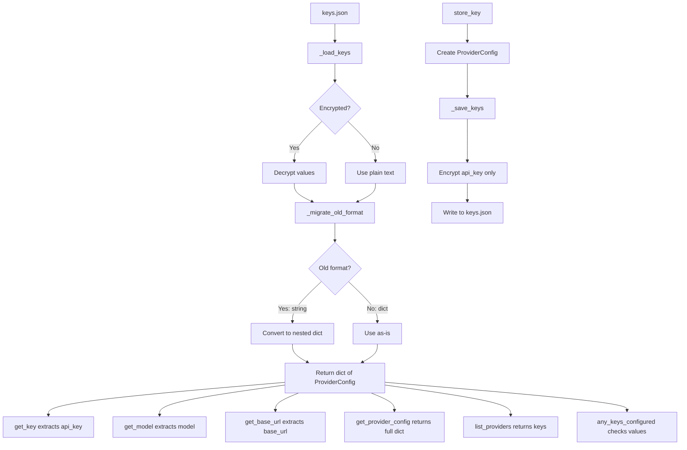

# KeyManager New Methods Implementation Plan

## Overview

This plan details the implementation of 5 new methods for the KeyManager class:

- `any_keys_configured()` - Check if any API keys are configured
- `list_providers()` - List all configured provider names
- `get_model(provider)` - Get the model for a provider
- `get_base_url(provider)` - Get the base URL for a provider
- `get_provider_config(provider)` - Get the full configuration for a provider

Additionally, the `store_key()` method signature will be extended to accept optional `model` and `base_url` parameters.

## Current State Analysis

### Existing Storage Format

The current KeyManager stores keys in an encrypted JSON file at `~/.specify/keys.json`:

```json
{
  "_version": 2,
  "_encrypted": true,
  "openai": "encrypted_string_here",
  "anthropic": "encrypted_string_here"
}
```

### New Storage Format (from sprint2a plan)

```json
{
  "_version": 3,
  "_encrypted": true,
  "openai": {
    "api_key": "encrypted_key",
    "model": "gpt-4",
    "base_url": null
  },
  "anthropic": {
    "api_key": "encrypted_key",
    "model": "claude-3-opus-20240229",
    "base_url": null
  },
  "ollama": {
    "api_key": null,
    "model": "llama3",
    "base_url": "http://localhost:11434"
  }
}
```

### Key Implementation Challenge

The existing `_load_keys()` returns `dict[str, str]` (provider -> decrypted key string). The new format requires returning `dict[str, dict]` (provider -> config object). This requires careful handling to maintain backward compatibility.

## Implementation Design

### Internal Data Structure

We need to track both formats internally. The approach:

1. **Internal storage**: `_load_keys()` will return the new nested format internally
2. **Migration on load**: Old format (simple strings) is auto-migrated to new format
3. **Backward compatibility**: `get_key()` continues to work by extracting `api_key` from the nested object

### Type Definitions

```python
from typing import TypedDict

class ProviderConfig(TypedDict, total=False):
    api_key: str | None
    model: str | None
    base_url: str | None
```

### Method Implementations

#### 1. `_migrate_old_format(keys: dict) -> dict[str, ProviderConfig]`

Private method to convert old format to new format.

**Logic:**

- If value is a string (old format), convert to `{"api_key": value, "model": None, "base_url": None}`
- If value is already a dict (new format), return as-is
- Skip metadata keys (starting with `_`)

```python
def _migrate_old_format(self, keys: dict[str, Any]) -> dict[str, ProviderConfig]:
    """Migrate old format keys to new nested format.

    Args:
        keys: Dictionary potentially containing old format keys.

    Returns:
        Dictionary with new nested format for all providers.
    """
    result: dict[str, ProviderConfig] = {}

    for key, value in keys.items():
        if key.startswith("_"):
            continue

        if isinstance(value, str):
            # Old format: simple string value
            result[key] = {
                "api_key": value,
                "model": None,
                "base_url": None,
            }
        elif isinstance(value, dict):
            # New format: already a dict
            result[key] = {
                "api_key": value.get("api_key"),
                "model": value.get("model"),
                "base_url": value.get("base_url"),
            }

    return result
```

#### 2. Updated `store_key()` signature

```python
def store_key(
    self,
    provider: str,
    key: str | None = None,
    model: str | None = None,
    base_url: str | None = None,
) -> None:
    """Store an API key and optional configuration for a provider.

    Args:
        provider: The provider name (must be one of: ollama, openai, anthropic).
        key: The API key to store (can be None for providers like Ollama).
        model: Optional model name to use for this provider.
        base_url: Optional base URL for the provider API.

    Raises:
        KeyValidationError: If the provider is invalid.
    """
```

**Validation changes:**

- For `ollama`, `key` can be None (local provider)
- For `openai` and `anthropic`, `key` must be provided and non-empty
- `model` and `base_url` are always optional

#### 3. `any_keys_configured() -> bool`

```python
def any_keys_configured(self) -> bool:
    """Check if any API keys are configured.

    Checks both the local store and environment variables.

    Returns:
        True if at least one provider has a configured key, False otherwise.
    """
    # Check local store
    keys = self._load_keys()
    for provider, config in keys.items():
        if config.get("api_key"):
            return True

    # Check environment variables
    for env_var in ENV_VAR_MAPPING.values():
        if os.environ.get(env_var):
            return True

    return False
```

#### 4. `list_providers() -> list[str]`

```python
def list_providers(self) -> list[str]:
    """List all configured provider names.

    Returns providers that have configuration in the local store,
    regardless of whether they have an API key set.

    Returns:
        Sorted list of provider names with stored configuration.
    """
    keys = self._load_keys()
    return sorted(keys.keys())
```

#### 5. `get_model(provider: str) -> str | None`

```python
def get_model(self, provider: str) -> str | None:
    """Get the configured model for a provider.

    Args:
        provider: The provider name to look up.

    Returns:
        The configured model name, or None if not set or provider not found.
    """
    provider_lower = provider.lower()
    keys = self._load_keys()

    if provider_lower in keys:
        return keys[provider_lower].get("model")

    return None
```

#### 6. `get_base_url(provider: str) -> str | None`

```python
def get_base_url(self, provider: str) -> str | None:
    """Get the configured base URL for a provider.

    Args:
        provider: The provider name to look up.

    Returns:
        The configured base URL, or None if not set or provider not found.
    """
    provider_lower = provider.lower()
    keys = self._load_keys()

    if provider_lower in keys:
        return keys[provider_lower].get("base_url")

    return None
```

#### 7. `get_provider_config(provider: str) -> dict | None`

```python
def get_provider_config(self, provider: str) -> dict | None:
    """Get the full configuration for a provider.

    Args:
        provider: The provider name to look up.

    Returns:
        Dictionary with api_key, model, and base_url, or None if provider
        not found in local store. Note: api_key is returned decrypted.
    """
    provider_lower = provider.lower()
    keys = self._load_keys()

    if provider_lower in keys:
        return dict(keys[provider_lower])

    return None
```

### Updated `_load_keys()` Method

The `_load_keys()` method needs significant changes to handle the new format:

```python
def _load_keys(self) -> dict[str, ProviderConfig]:
    """Load keys from the JSON file.

    Handles both encrypted and plain-text formats, as well as
    old simple-string format and new nested-object format.

    Returns:
        Dictionary of provider -> ProviderConfig mappings.
        Returns empty dict if file doesn't exist.
    """
    if not self.keys_file.exists():
        return {}

    try:
        with self.keys_file.open(encoding="utf-8") as f:
            data = json.load(f)

        if not isinstance(data, dict):
            return {}

        is_encrypted = data.get("_encrypted", False)
        raw_keys: dict[str, Any] = {}

        for key, value in data.items():
            if key.startswith("_"):
                continue

            if is_encrypted:
                # Decrypt the value
                if isinstance(value, dict):
                    # New format: decrypt nested api_key
                    decrypted_value: dict[str, Any] = {}
                    for k, v in value.items():
                        if k == "api_key" and v is not None:
                            decrypted_value[k] = self._crypto_manager.decrypt(v)
                        else:
                            decrypted_value[k] = v
                    raw_keys[key] = decrypted_value
                else:
                    # Old format: decrypt simple string
                    raw_keys[key] = self._crypto_manager.decrypt(value)
            else:
                # Plain text
                raw_keys[key] = value

        # Migrate to new format if needed
        result = self._migrate_old_format(raw_keys)

        # Save in new format if migration occurred
        if any(isinstance(v, str) for v in data.values() if not isinstance(v, dict) and not str(v).startswith("_")):
            self._save_keys(result)

        return result

    except json.JSONDecodeError as e:
        raise KeyValidationError(f"Invalid keys file format: {e}") from e
```

### Updated `_save_keys()` Method

```python
def _save_keys(self, keys: dict[str, ProviderConfig]) -> None:
    """Save keys to the JSON file in encrypted format.

    Args:
        keys: Dictionary of provider -> ProviderConfig mappings.
    """
    encrypted_data: dict[str, Any] = {
        "_version": 3,
        "_encrypted": True,
    }

    for provider, config in keys.items():
        encrypted_config: dict[str, Any] = {}

        # Encrypt api_key if present
        if config.get("api_key"):
            encrypted_config["api_key"] = self._crypto_manager.encrypt(config["api_key"])
        else:
            encrypted_config["api_key"] = None

        # Store model and base_url as plain text (not sensitive)
        encrypted_config["model"] = config.get("model")
        encrypted_config["base_url"] = config.get("base_url")

        encrypted_data[provider] = encrypted_config

    with self.keys_file.open("w", encoding="utf-8") as f:
        json.dump(encrypted_data, f, indent=2, sort_keys=True)

    self.keys_file.chmod(stat.S_IRUSR | stat.S_IWUSR)
```

### Updated `get_key()` Method

The `get_key()` method needs to extract the `api_key` from the new nested format:

```python
def get_key(self, provider: str) -> str:
    """Retrieve an API key for a provider."""
    provider_lower = provider.lower()

    # 1. Check local store
    keys = self._load_keys()
    if provider_lower in keys:
        api_key = keys[provider_lower].get("api_key")
        if api_key:
            return api_key

    # 2. Check environment variables
    env_var_name = ENV_VAR_MAPPING.get(provider_lower)
    if env_var_name:
        env_value = os.environ.get(env_var_name)
        if env_value:
            return env_value

    # 3. Not found
    raise KeyNotFoundError(provider_lower)
```

### Updated `list_keys()` Method

The `list_keys()` method should continue to work with masked keys:

```python
def list_keys(self) -> dict[str, str]:
    """List all stored API keys with masked values."""
    keys = self._load_keys()

    # Add keys from environment variables if not in file
    for provider, env_var in ENV_VAR_MAPPING.items():
        if provider not in keys:
            env_value = os.environ.get(env_var)
            if env_value:
                keys[provider] = {
                    "api_key": env_value,
                    "model": None,
                    "base_url": None,
                }

    # Mask all keys for display
    masked_keys = {}
    for provider, config in keys.items():
        api_key = config.get("api_key")
        if api_key:
            masked_keys[provider] = self._mask_key(api_key)

    return masked_keys
```

## Test Plan

### Test Categories

1. **New Method Tests**
   - `test_any_keys_configured_empty` - No keys configured
   - `test_any_keys_configured_with_key` - Key in local store
   - `test_any_keys_configured_with_env` - Key in environment
   - `test_list_providers_empty` - No providers
   - `test_list_providers_multiple` - Multiple providers
   - `test_get_model_set` - Model is configured
   - `test_get_model_not_set` - Model not configured
   - `test_get_model_nonexistent_provider` - Provider doesn't exist
   - `test_get_base_url_set` - Base URL configured
   - `test_get_base_url_not_set` - Base URL not configured
   - `test_get_provider_config_full` - All fields set
   - `test_get_provider_config_partial` - Some fields set
   - `test_get_provider_config_nonexistent` - Provider doesn't exist

2. **Updated store_key() Tests**
   - `test_store_key_with_model` - Store key with model
   - `test_store_key_with_base_url` - Store key with base URL
   - `test_store_key_with_all_options` - Store with all options
   - `test_store_key_ollama_no_key` - Ollama can have no API key
   - `test_store_key_openai_requires_key` - OpenAI requires key

3. **Backward Compatibility Tests**
   - `test_migrate_old_format_string` - Old string format migrates
   - `test_migrate_old_format_dict` - New dict format preserved
   - `test_load_old_format_file` - Load file with old format
   - `test_get_key_after_migration` - get_key works after migration

4. **Regression Tests**
   - All existing tests should continue to pass

## Implementation Order

1. Define `ProviderConfig` TypedDict
2. Implement `_migrate_old_format()` private method
3. Update `_load_keys()` to use new format and migration
4. Update `_save_keys()` to save in new format
5. Update `store_key()` signature
6. Update `get_key()` to extract from nested format
7. Update `list_keys()` to work with nested format
8. Implement `any_keys_configured()`
9. Implement `list_providers()`
10. Implement `get_model()`
11. Implement `get_base_url()`
12. Implement `get_provider_config()`
13. Add all new tests
14. Run full test suite

## File Changes Summary

| File                          | Changes                                                                          |
| ----------------------------- | -------------------------------------------------------------------------------- |
| `specify/core/key_manager.py` | Add ProviderConfig TypedDict, implement 5 new methods, update 4 existing methods |
| `tests/test_key_manager.py`   | Add test classes for new methods and backward compatibility                      |

## Mermaid Diagram: Data Flow



## Acceptance Criteria Checklist

- [ ] All 5 new methods implemented with proper type hints and docstrings
- [ ] `store_key()` signature extended to accept optional model and base_url parameters
- [ ] Backward compatibility: old format (simple strings) is migrated to new format on load
- [ ] Unit tests added for each new method
- [ ] Unit tests added for updated store_key() signature
- [ ] Unit tests added for backward compatibility migration
- [ ] Existing tests continue to pass
