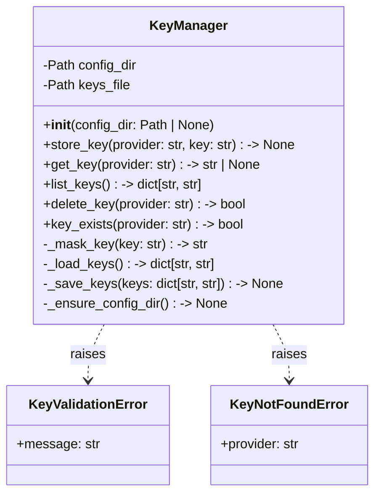

# Sprint 2: API Key Storage Implementation Plan

## Overview

This document provides the detailed implementation plan for Sprint 2 (Week 2) of Specify.AI, covering user stories US-001 (store key), US-002 (list keys), and US-003 (delete key).

## Current State Analysis

### Existing Files

- [`specify/cli.py`](specify/cli.py) - Contains stub implementations for `set-key`, `list-keys`, `delete-key` commands
- [`specify/core/__init__.py`](specify/core/__init__.py) - Empty exports, ready for KeyManager
- [`tests/conftest.py`](tests/conftest.py) - Has `temp_config_dir` fixture for isolated testing
- [`tests/test_cli.py`](tests/test_cli.py) - Existing test patterns to follow

### Key Observations from Code Review

1. CLI uses Click framework with `@click.group()` and subcommands
2. Existing code style: `from __future__ import annotations`, type hints, docstrings
3. Test fixtures use `tmp_path` from pytest for temporary directories
4. CLI commands currently print placeholder messages

---

## Implementation Design

### 1. KeyManager Class Design



### 2. File Structure

```
~/.specify/
└── keys.json    # JSON file storing API keys
```

### 3. keys.json Format

```json
{
  "openai": "sk-proj-abc123...",
  "anthropic": "sk-ant-xyz789...",
  "ollama": "http://localhost:11434"
}
```

### 4. Method Specifications

#### `__init__(self, config_dir: Path | None = None)`

- **Purpose**: Initialize KeyManager with optional custom config directory
- **Parameters**:
  - `config_dir`: Optional custom directory for keys file. If None, uses `Path.home() / ".specify"`
- **Behavior**: Sets `self.keys_file` to `config_dir / "keys.json"`

#### `store_key(self, provider: str, key: str) -> None`

- **Purpose**: Store an API key for a provider
- **Parameters**:
  - `provider`: Provider name (must be one of: "ollama", "openai", "anthropic")
  - `key`: API key value (must not be empty)
- **Raises**:
  - `KeyValidationError`: If provider is invalid or key is empty
- **Behavior**:
  1. Validate provider is in allowed list
  2. Validate key is not empty
  3. Ensure config directory exists
  4. Load existing keys
  5. Add/update the key
  6. Save keys to file

#### `get_key(self, provider: str) -> str | None`

- **Purpose**: Retrieve an API key for a provider
- **Parameters**:
  - `provider`: Provider name
- **Returns**: The API key if found, None otherwise
- **Behavior**: Load keys from file and return the key for the provider

#### `list_keys(self) -> dict[str, str]`

- **Purpose**: List all stored keys with masked values
- **Returns**: Dictionary mapping provider names to masked keys
- **Behavior**:
  1. Load keys from file
  2. Return empty dict if file doesn't exist
  3. Mask each key using `_mask_key()`

#### `delete_key(self, provider: str) -> bool`

- **Purpose**: Delete a stored API key
- **Parameters**:
  - `provider`: Provider name
- **Returns**: True if key was deleted, False if key didn't exist
- **Behavior**:
  1. Load keys from file
  2. If provider not in keys, return False
  3. Remove provider from keys
  4. Save keys to file
  5. Return True

#### `key_exists(self, provider: str) -> bool`

- **Purpose**: Check if a key exists for a provider
- **Parameters**:
  - `provider`: Provider name
- **Returns**: True if key exists, False otherwise

#### `_mask_key(self, key: str) -> str` (private)

- **Purpose**: Mask a key for display
- **Parameters**:
  - `key`: The API key to mask
- **Returns**: Masked key string
- **Masking Rules**:
  - Key length >= 6: Show first 3 chars + "..." + last 3 chars (e.g., "sk-...abc")
  - Key length < 6: Show "\*\*\*" (three asterisks)

#### `_load_keys(self) -> dict[str, str]` (private)

- **Purpose**: Load keys from the JSON file
- **Returns**: Dictionary of provider -> key mappings
- **Behavior**:
  - Return empty dict if file doesn't exist
  - Parse JSON and return dict
  - Raise appropriate error if JSON is corrupted

#### `_save_keys(self, keys: dict[str, str]) -> None` (private)

- **Purpose**: Save keys to the JSON file
- **Parameters**:
  - `keys`: Dictionary of provider -> key mappings
- **Behavior**:
  - Ensure directory exists
  - Write JSON to file with proper formatting

#### `_ensure_config_dir(self) -> None` (private)

- **Purpose**: Ensure the config directory exists
- **Behavior**: Create directory if it doesn't exist (with parents=True)

---

## Exception Classes

### `KeyValidationError(Exception)`

Raised when key validation fails.

```python
class KeyValidationError(Exception):
    """Raised when API key validation fails."""
    pass
```

### `KeyNotFoundError(Exception)`

Raised when attempting to delete a non-existent key (optional, can also return False).

```python
class KeyNotFoundError(Exception):
    """Raised when a key is not found for a provider."""
    def __init__(self, provider: str):
        self.provider = provider
        super().__init__(f"No key found for provider: {provider}")
```

---

## CLI Integration

### Update `set_key` command

```python
@config.command(name="set-key")
@click.option("--provider", "-p", required=True, ...)
@click.option("--key", "-k", required=True, ...)
def set_key(provider: str, key: str) -> None:
    """Store an API key for a provider."""
    try:
        key_manager = KeyManager()
        key_manager.store_key(provider, key)
        click.echo(f"✓ API key stored for {provider}")
    except KeyValidationError as e:
        raise click.ClickException(str(e))
```

### Update `list_keys` command

```python
@config.command(name="list-keys")
def list_keys() -> None:
    """List all configured providers."""
    key_manager = KeyManager()
    keys = key_manager.list_keys()

    if not keys:
        click.echo("No API keys configured.")
        return

    # Print formatted table
    click.echo("Configured API Keys:")
    click.echo("-" * 40)
    for provider, masked_key in keys.items():
        click.echo(f"  {provider}: {masked_key}")
```

### Update `delete_key` command

```python
@config.command(name="delete-key")
@click.option("--provider", "-p", required=True, ...)
def delete_key(provider: str) -> None:
    """Delete a stored API key."""
    key_manager = KeyManager()

    if not key_manager.delete_key(provider):
        raise click.ClickException(f"No key found for provider: {provider}")

    click.echo(f"✓ API key deleted for {provider}")
```

---

## Test Plan

### Unit Tests for KeyManager

| Test ID | Description                | Setup            | Action                              | Expected Result                  |
| ------- | -------------------------- | ---------------- | ----------------------------------- | -------------------------------- |
| UT-01   | Store key for new provider | Fresh KeyManager | `store_key("openai", "sk-test123")` | Key saved, no error              |
| UT-02   | Retrieve stored key        | Store key first  | `get_key("openai")`                 | Returns "sk-test123"             |
| UT-03   | List stored keys           | Store 2 keys     | `list_keys()`                       | Dict with 2 entries, keys masked |
| UT-04   | Delete stored key          | Store key first  | `delete_key("openai")`              | Returns True, key removed        |
| UT-05   | Overwrite existing key     | Store key twice  | Store, store again                  | Second key replaces first        |
| UT-06   | Get non-existent key       | Fresh KeyManager | `get_key("nonexistent")`            | Returns None                     |
| UT-07   | List when no keys          | Fresh KeyManager | `list_keys()`                       | Returns empty dict               |
| UT-08   | Delete non-existent key    | Fresh KeyManager | `delete_key("nonexistent")`         | Returns False                    |
| UT-09   | Mask short key             | Key "abc"        | `_mask_key("abc")`                  | Returns "\*\*\*"                 |
| UT-10   | Mask normal key            | Key "sk-test123" | `_mask_key("sk-test123")`           | Returns "sk-...123"              |
| UT-11   | Store empty key            | Fresh KeyManager | `store_key("openai", "")`           | Raises KeyValidationError        |
| UT-12   | Store invalid provider     | Fresh KeyManager | `store_key("invalid", "key")`       | Raises KeyValidationError        |
| UT-13   | Custom config directory    | Pass custom dir  | Store and retrieve                  | Works with custom dir            |
| UT-14   | Corrupted JSON file        | Create bad JSON  | `list_keys()`                       | Raises appropriate error         |

### CLI Integration Tests

| Test ID | Description                | Command                                       | Expected Output                            |
| ------- | -------------------------- | --------------------------------------------- | ------------------------------------------ |
| CT-01   | Set key success            | `specify config set-key -p openai -k sk-test` | "✓ API key stored for openai"              |
| CT-02   | Set key with empty key     | `specify config set-key -p openai -k ""`      | Error message                              |
| CT-03   | List keys with keys stored | Store key, then list                          | Shows provider with masked key             |
| CT-04   | List keys with no keys     | Fresh install                                 | "No API keys configured."                  |
| CT-05   | Delete key success         | Store key, then delete                        | "✓ API key deleted for openai"             |
| CT-06   | Delete non-existent key    | `specify config delete-key -p openai`         | Error: "No key found for provider: openai" |

---

## Edge Cases & Error Handling

### Edge Case Matrix

| #   | Scenario                          | Expected Behavior                                        |
| --- | --------------------------------- | -------------------------------------------------------- |
| 1   | Store key for new provider        | Creates new entry in keys.json                           |
| 2   | Store key for existing provider   | Overwrites existing key                                  |
| 3   | List keys when no keys stored     | Returns empty dict, CLI prints "No API keys configured." |
| 4   | Get key for non-existent provider | Returns None                                             |
| 5   | Delete non-existent key           | Returns False, CLI raises ClickException                 |
| 6   | Corrupted keys.json file          | Raises JSONDecodeError with clear message                |
| 7   | Permission denied on .specify dir | Raises PermissionError with clear message                |
| 8   | Key with length < 6 characters    | Mask as \*\*\*                                           |
| 9   | Empty key string                  | Raise KeyValidationError                                 |

---

## Implementation Order

1. **Create `specify/core/key_manager.py`**
   - Define exception classes
   - Implement KeyManager class with all methods
   - Add comprehensive docstrings

2. **Update `specify/core/__init__.py`**
   - Export KeyManager
   - Export exception classes

3. **Write unit tests in `tests/test_key_manager.py`**
   - Test all methods
   - Test edge cases
   - Use `temp_config_dir` fixture

4. **Update CLI commands in `specify/cli.py`**
   - Import KeyManager
   - Replace stub implementations
   - Handle exceptions properly

5. **Add CLI integration tests in `tests/test_cli.py`**
   - Test config commands with actual KeyManager
   - Mock file system where appropriate

6. **Run verification loop**
   - Run all tests
   - Fix any issues
   - Run type checker
   - Run linter
   - Run formatter

---

## Verification Checklist

After implementation, verify:

- [ ] `specify config set-key --provider openai --key sk-test` stores key successfully
- [ ] `specify config list-keys` shows stored keys with masked values
- [ ] `specify config delete-key --provider openai` removes key successfully
- [ ] All unit tests pass: `pytest tests/test_key_manager.py -v`
- [ ] All CLI tests pass: `pytest tests/test_cli.py -v`
- [ ] Type checker: 0 errors (`mypy specify`)
- [ ] Linter: 0 errors (`ruff check .`)
- [ ] Formatter: passes (`black --check .`)
- [ ] Keys stored in `~/.specify/keys.json`
- [ ] Keys are masked when listed (e.g., `sk-...123`)

---

## Dependencies

No new dependencies required. All functionality uses Python standard library:

- `pathlib` for file operations
- `json` for JSON parsing
- `typing` for type hints

The `cryptography` package is already in `requirements.txt` for future encryption (Sprint 3).
