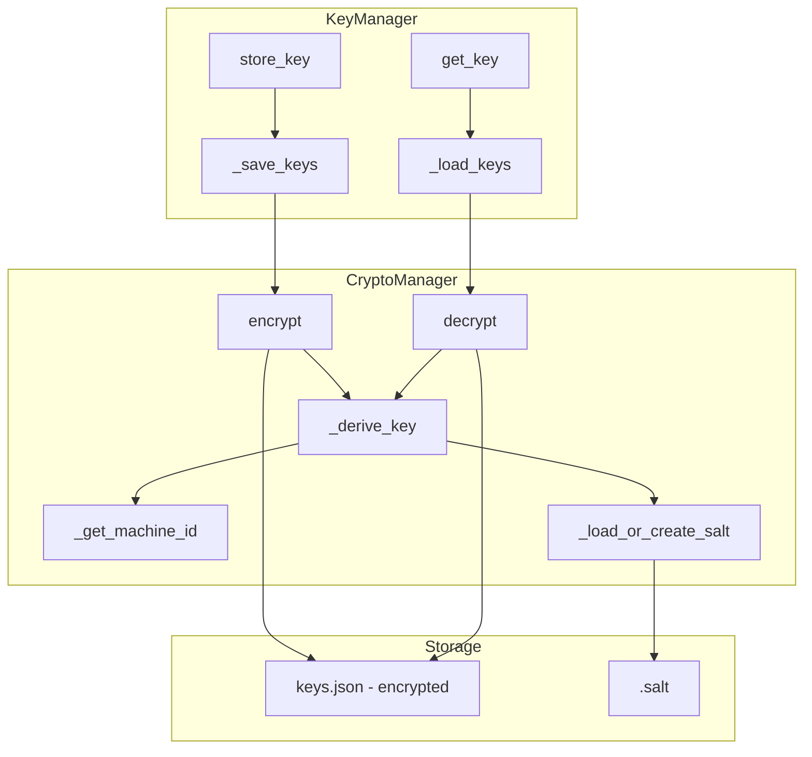
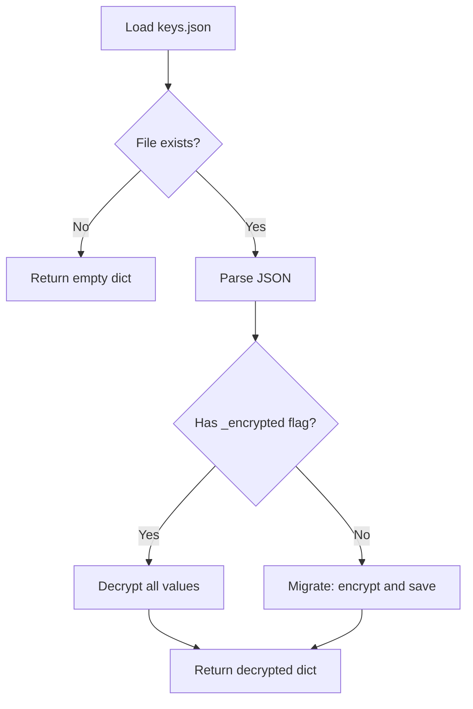
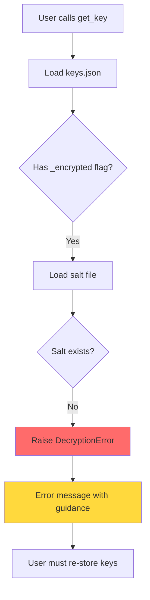
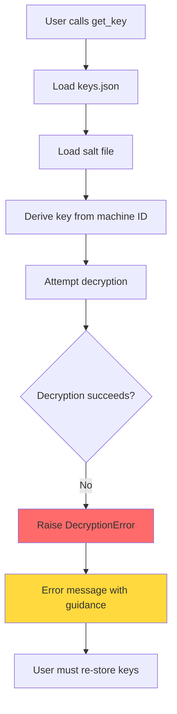
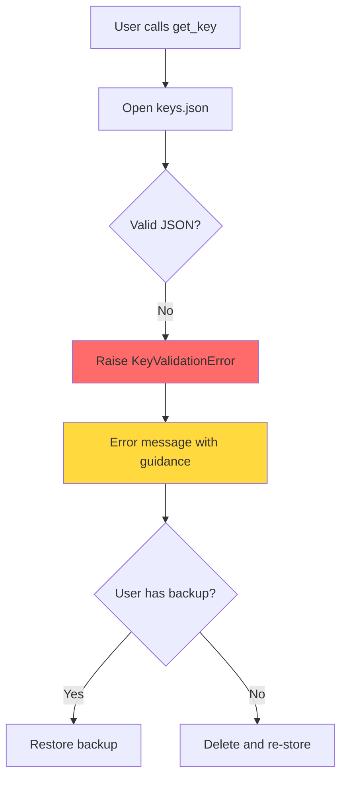
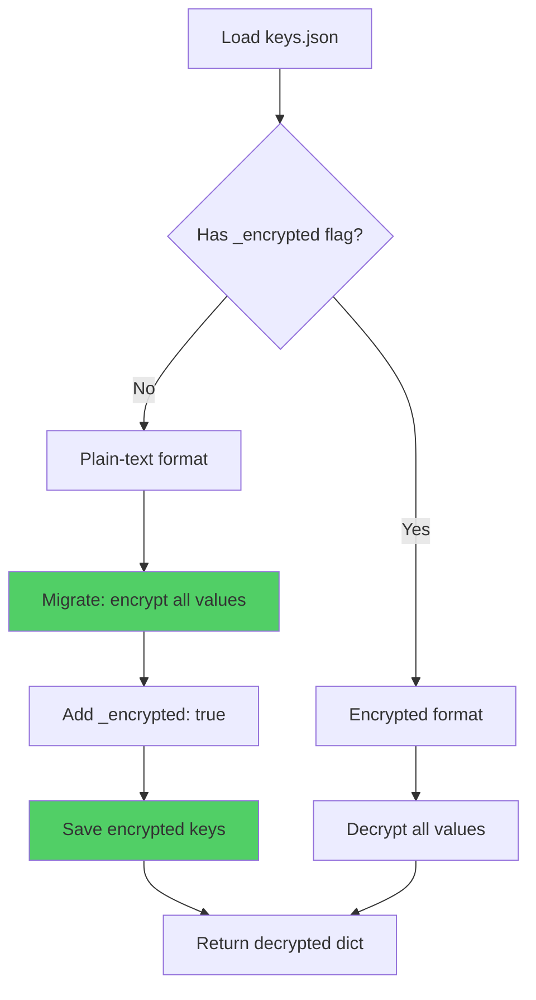
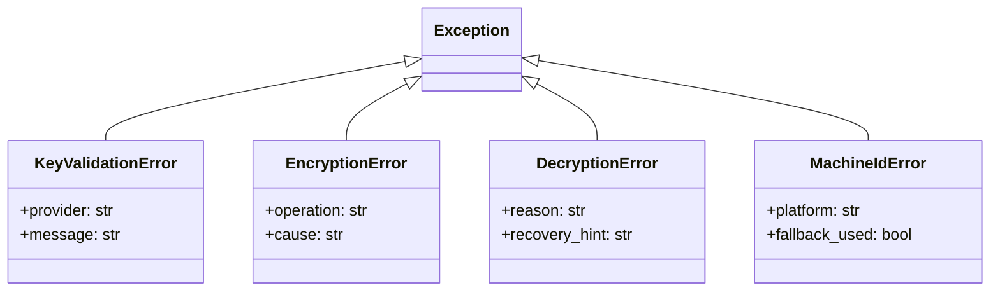

# API Key Encryption Implementation Plan

## Overview

This plan details the implementation of encryption for API key storage in the [`KeyManager`](specify/core/key_manager.py:77) class, transforming the current plain-text JSON storage into encrypted storage using Fernet (AES-128-CBC with HMAC) from the cryptography library.

## Current State Analysis

### Existing Implementation

The [`KeyManager`](specify/core/key_manager.py:77) class currently:

- Stores API keys in plain text at `~/.specify/keys.json`
- Has file permissions set to `chmod 600` (already implemented)
- Contains a docstring noting: "This is Sprint 2 implementation - keys are stored in plain text without encryption"

### Key Files to Modify

| File                                                           | Purpose                                |
| -------------------------------------------------------------- | -------------------------------------- |
| [`specify/core/key_manager.py`](specify/core/key_manager.py:1) | Add encryption/decryption logic        |
| [`specify/core/__init__.py`](specify/core/__init__.py:1)       | Export new exception classes           |
| [`tests/test_key_manager.py`](tests/test_key_manager.py:1)     | Add tests for encryption functionality |

## Architecture Design

### Component Overview



### CryptoManager Class Design

A new `CryptoManager` class will handle all cryptographic operations:

```python
class CryptoManager:
    """Manages encryption and decryption of sensitive data using Fernet."""

    SALT_FILE_NAME: str = ".salt"
    PBKDF2_ITERATIONS: int = 1_200_000  # OWASP recommended minimum

    def __init__(self, config_dir: Path) -> None:
        """Initialize CryptoManager with the config directory."""

    def encrypt(self, plaintext: str) -> str:
        """Encrypt a plaintext string and return base64-encoded ciphertext."""

    def decrypt(self, ciphertext: str) -> str:
        """Decrypt a ciphertext string and return plaintext."""

    def _get_machine_id(self) -> bytes:
        """Get a machine-specific identifier for key derivation."""

    def _derive_key(self) -> bytes:
        """Derive a Fernet key from machine ID and salt."""

    def _load_or_create_salt(self) -> bytes:
        """Load existing salt or create and store a new one."""
```

### Machine-Specific Identifier Strategy

For cross-platform compatibility, the machine identifier will be derived from:

1. **Primary**: `machine-id` on Linux (`/etc/machine-id` or `/var/lib/dbus/machine-id`)
2. **macOS**: IOPlatformUUID via `ioreg` command
3. **Windows**: MachineGuid from registry
4. **Fallback**: Combination of hostname + username (less secure but portable)

```mermaid
flowchart TD
    A[Get Machine ID] --> B{Platform}
    B -->|Linux| C[/etc/machine-id]
    B -->|macOS| D[ioreg IOPlatformUUID]
    B -->|Windows| E[Registry MachineGuid]
    B -->|Fallback| F[hostname + username]
    C --> G[Return as bytes]
    D --> G
    E --> G
    F --> G
```

### Key Derivation Flow

```python
# Pseudocode for key derivation
salt = load_or_create_salt()  # 16 random bytes, stored in ~/.specify/.salt
machine_id = get_machine_id()  # Machine-specific identifier
iterations = 1_200_000  # OWASP recommended

kdf = PBKDF2HMAC(
    algorithm=hashes.SHA256(),
    length=32,
    salt=salt,
    iterations=iterations,
)
fernet_key = base64.urlsafe_b64encode(kdf.derive(machine_id))
```

### Data Storage Format

The `keys.json` file will store encrypted values with a version marker:

```json
{
  "_version": 2,
  "_encrypted": true,
  "openai": "gAAAAABm...encrypted_base64...",
  "anthropic": "gAAAAABm...encrypted_base64..."
}
```

### Backward Compatibility Strategy

The migration flow handles existing plain-text keys:



## Exception Handling

### New Exception Classes

```python
class EncryptionError(Exception):
    """Raised when encryption operations fail."""

class DecryptionError(Exception):
    """Raised when decryption fails due to corrupted data or missing salt."""

class MachineIdError(Exception):
    """Raised when unable to get machine-specific identifier."""
```

### Error Scenarios

| Scenario                                | Handling                                       |
| --------------------------------------- | ---------------------------------------------- |
| Salt file missing, no keys exist        | Create new salt on first write                 |
| Salt file missing, encrypted keys exist | Raise `DecryptionError` with recovery guidance |
| Corrupted keys.json                     | Raise `KeyValidationError` with clear message  |
| Corrupted salt file                     | Raise `DecryptionError` with recovery guidance |
| Machine ID changes                      | Raise `DecryptionError` with recovery guidance |
| Partial migration                       | Encrypt plain-text keys on next write          |

## Implementation Steps

### Step 1: Create CryptoManager Class

Create the `CryptoManager` class in [`specify/core/key_manager.py`](specify/core/key_manager.py:1) with:

- `__init__(self, config_dir: Path)`
- `encrypt(self, plaintext: str) -> str`
- `decrypt(self, ciphertext: str) -> str`
- `_get_machine_id(self) -> bytes`
- `_derive_key(self) -> bytes`
- `_load_or_create_salt(self) -> bytes`

### Step 2: Add Exception Classes

Add new exception classes:

- `EncryptionError`
- `DecryptionError`
- `MachineIdError`

### Step 3: Integrate with KeyManager

Modify `KeyManager` class:

- Add `CryptoManager` instance in `__init__`
- Modify `_save_keys()` to encrypt values before saving
- Modify `_load_keys()` to detect and decrypt encrypted values
- Add migration logic for plain-text keys

### Step 4: Update Exports

Update [`specify/core/__init__.py`](specify/core/__init__.py:14) to export new exception classes.

### Step 5: Add Tests

Add comprehensive tests in [`tests/test_key_manager.py`](tests/test_key_manager.py:1):

- Test encryption/decryption round-trip
- Test salt generation and persistence
- Test backward compatibility with plain-text keys
- Test error handling scenarios
- Test machine ID retrieval

### Step 6: Update Documentation

Update docstrings to reflect encryption implementation.

## Test Plan

### Unit Tests for CryptoManager

| Test                                        | Description                                            |
| ------------------------------------------- | ------------------------------------------------------ |
| `test_encrypt_decrypt_roundtrip`            | Verify encrypt/decrypt returns original value          |
| `test_salt_persistence`                     | Salt is saved and reused across instances              |
| `test_salt_creation_first_time`             | New salt created when none exists                      |
| `test_different_salts_different_ciphertext` | Same plaintext, different salts = different ciphertext |
| `test_machine_id_retrieval`                 | Machine ID is retrieved correctly                      |
| `test_machine_id_consistency`               | Same machine ID across multiple calls                  |

### Integration Tests for KeyManager

| Test                                     | Description                              |
| ---------------------------------------- | ---------------------------------------- |
| `test_store_key_encrypts`                | Stored keys are encrypted in file        |
| `test_get_key_decrypts`                  | Retrieved keys are decrypted correctly   |
| `test_list_keys_masks_decrypted`         | list_keys shows masked decrypted values  |
| `test_backward_compatibility_plain_text` | Plain-text keys are migrated on read     |
| `test_persistence_across_instances`      | Keys persist correctly between instances |

### Error Handling Tests

| Test                                    | Description                                   |
| --------------------------------------- | --------------------------------------------- |
| `test_missing_salt_with_encrypted_keys` | Clear error when salt missing                 |
| `test_corrupted_salt_file`              | Clear error when salt corrupted               |
| `test_corrupted_keys_file`              | Clear error when keys.json corrupted          |
| `test_machine_id_unavailable`           | Fallback behavior when machine ID unavailable |

## Error Recovery Scenarios

This section details all error scenarios, their causes, detection methods, and recovery procedures.

### Error Scenario Matrix

| Scenario | Detection | Error Type | Recovery Possible | User Action Required |
|----------|-----------|------------|-------------------|---------------------|
| Salt file missing, no keys exist | Salt file check on write | None - auto-create | Yes - automatic | None |
| Salt file missing, encrypted keys exist | Salt file check on read | `DecryptionError` | No - keys unrecoverable | Re-store keys |
| Salt file corrupted | Invalid salt format on read | `DecryptionError` | No - keys unrecoverable | Re-store keys |
| Keys.json corrupted | JSON parse error | `KeyValidationError` | Partial - delete file | Re-store keys |
| Machine ID changed | Decryption fails | `DecryptionError` | No - keys unrecoverable | Re-store keys |
| Partial migration state | Mixed encrypted/plain keys | Auto-migrate | Yes - automatic | None |
| Permission denied on salt file | OS permission error | `EncryptionError` | Yes - fix permissions | Fix file permissions |
| Permission denied on keys file | OS permission error | `KeyValidationError` | Yes - fix permissions | Fix file permissions |

### Detailed Error Flows

#### Scenario 1: Salt File Missing with Encrypted Keys



**Error Message:**
```
DecryptionError: Cannot decrypt API keys - salt file is missing.

This can happen if:
1. The .salt file was accidentally deleted
2. You moved your keys.json to a new machine without the .salt file

Recovery options:
- If you have a backup of ~/.specify/.salt, restore it
- Otherwise, you will need to re-store your API keys:
  specify store-key openai YOUR_API_KEY

Location checked: ~/.specify/.salt
```

#### Scenario 2: Machine ID Changed



**Error Message:**
```
DecryptionError: Cannot decrypt API keys - decryption failed.

This typically happens when:
1. You moved to a new machine
2. Your machine's hardware identifier changed
3. The keys.json or .salt file is corrupted

Recovery options:
- If migrating to a new machine, copy BOTH files:
  - ~/.specify/keys.json
  - ~/.specify/.salt
- If files are corrupted, you will need to re-store your keys:
  specify store-key openai YOUR_API_KEY
```

#### Scenario 3: Corrupted keys.json



**Error Message:**
```
KeyValidationError: Invalid keys file format: Expecting value: line 1 column 1 (char 0)

The keys.json file appears to be corrupted.

Recovery options:
1. If you have a backup, restore ~/.specify/keys.json
2. Otherwise, delete the corrupted file and re-store your keys:
   rm ~/.specify/keys.json
   specify store-key openai YOUR_API_KEY

File location: ~/.specify/keys.json
```

#### Scenario 4: Partial Migration (Mixed Plain-text and Encrypted)



**Implementation:**
```python
def _load_keys(self) -> dict[str, str]:
    """Load and decrypt keys, migrating if necessary."""
    if not self.keys_file.exists():
        return {}
    
    with self.keys_file.open(encoding="utf-8") as f:
        data = json.load(f)
    
    if not isinstance(data, dict):
        return {}
    
    # Check if keys are encrypted
    is_encrypted = data.get("_encrypted", False)
    
    result = {}
    needs_migration = False
    
    for key, value in data.items():
        if key.startswith("_"):
            continue  # Skip metadata keys
        
        if is_encrypted:
            # Decrypt the value
            result[key] = self._crypto_manager.decrypt(value)
        else:
            # Plain text - needs migration
            result[key] = value
            needs_migration = True
    
    # Migrate plain-text keys to encrypted format
    if needs_migration and result:
        self._save_keys(result)
    
    return result
```

### Recovery Procedures

#### For Users

1. **Backup Recommendation**: Users should backup both files:
   ```bash
   # Backup
   cp ~/.specify/keys.json ~/.specify/keys.json.backup
   cp ~/.specify/.salt ~/.specify/.salt.backup
   
   # Restore
   cp ~/.specify/keys.json.backup ~/.specify/keys.json
   cp ~/.specify/.salt.backup ~/.specify/.salt
   ```

2. **Machine Migration**: When moving to a new machine:
   ```bash
   # On old machine - copy both files
   scp ~/.specify/keys.json ~/.specify/.salt newmachine:~/.specify/
   ```

3. **Key Recovery**: If keys are lost, re-store them:
   ```bash
   specify store-key openai sk-proj-xxxxx
   specify store-key anthropic sk-ant-xxxxx
   ```

#### For Developers

1. **Testing Error Scenarios**: Each error scenario should have dedicated tests
2. **Error Message Quality**: Messages should be actionable and specific
3. **Logging**: Log errors (without sensitive data) for debugging

### Exception Hierarchy



## Security Considerations

### Strengths

1. **AES-128-CBC with HMAC**: Fernet provides authenticated encryption
2. **PBKDF2 with high iterations**: 1.2M iterations makes brute-force attacks expensive
3. **Machine-specific binding**: Keys only decryptable on same machine
4. **Salt uniqueness**: Each installation has unique salt

### Limitations

1. **Machine ID dependency**: If machine ID changes, keys become unrecoverable
2. **Local storage**: Physical access to machine compromises keys
3. **No key rotation**: No built-in mechanism for re-encrypting with new key

### Mitigations

1. Provide clear error messages with recovery guidance
2. Document backup procedures for keys.json and .salt
3. Consider future feature for key export/import

## Success Criteria

- [ ] All existing tests in [`tests/test_key_manager.py`](tests/test_key_manager.py:1) pass
- [ ] New tests for encryption/decryption functionality pass
- [ ] Keys stored in `keys.json` are encrypted (not human-readable)
- [ ] `KeyManager.get_key()` returns decrypted keys correctly
- [ ] `KeyManager.list_keys()` returns masked keys correctly
- [ ] `pytest tests/test_key_manager.py -v` passes
- [ ] `pytest tests/ -v` passes
- [ ] `mypy specify` passes
- [ ] `ruff check .` passes

## File Changes Summary

| File                                                           | Changes                                                         |
| -------------------------------------------------------------- | --------------------------------------------------------------- |
| [`specify/core/key_manager.py`](specify/core/key_manager.py:1) | Add `CryptoManager` class, new exceptions, integrate encryption |
| [`specify/core/__init__.py`](specify/core/__init__.py:1)       | Export new exception classes                                    |
| [`tests/test_key_manager.py`](tests/test_key_manager.py:1)     | Add encryption tests                                            |

## Dependencies

The `cryptography` library is already included in [`requirements.txt`](requirements.txt:20):

```
cryptography>=42.0.0
```

No new dependencies required.
