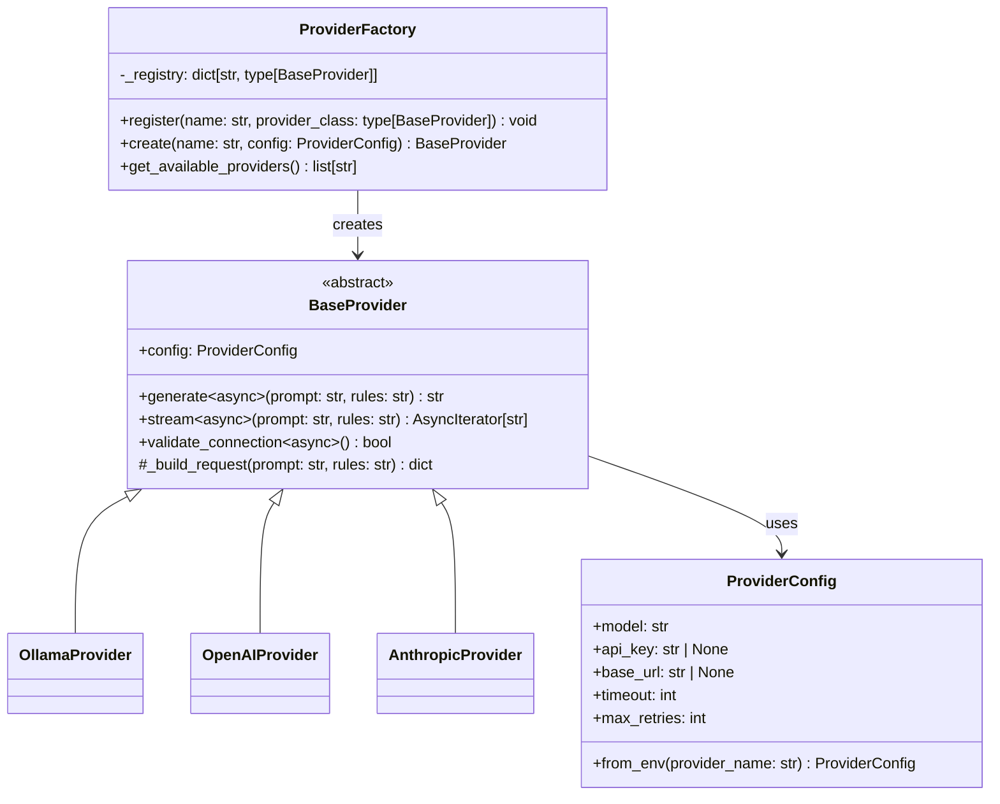
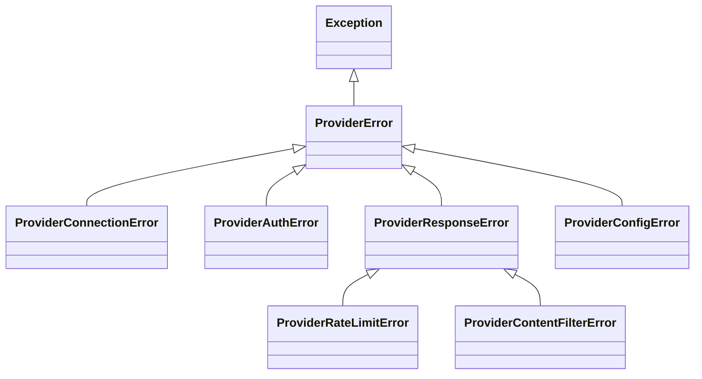

# Sprint 3: LLM Abstraction Layer Implementation Plan

## Overview

This plan details the implementation of the LLM abstraction layer (provider interface and factory) for Sprint 3, excluding the Ollama client implementation.

**Reference:**

- Implementation Plan: [`plans/implementation/implementation-plan.md`](plans/implementation/implementation-plan.md) - Phase 2 Section 2.3, Phase 3 Section 3.2
- Architecture Diagram: Lines 216-229
- Coverage Requirements: Lines 639-645

---

## Architecture

### Provider Interface Design



### Exception Hierarchy



---

## File Structure

```
specify/
├── providers/
│   ├── __init__.py          # Module exports
│   ├── base.py              # Abstract BaseProvider, exceptions, factory
│   ├── ollama.py            # Ollama client (NOT IN SCOPE)
│   ├── openai.py            # OpenAI client (NOT IN SCOPE)
│   └── anthropic.py         # Anthropic client (NOT IN SCOPE)

tests/
├── test_providers/
│   ├── __init__.py
│   ├── conftest.py          # Provider-specific fixtures
│   ├── test_base.py         # Tests for BaseProvider, exceptions, factory
│   ├── test_ollama.py       # Ollama tests (NOT IN SCOPE)
│   ├── test_openai.py       # OpenAI tests (NOT IN SCOPE)
│   └── test_anthropic.py    # Anthropic tests (NOT IN SCOPE)
```

---

## Implementation Details

### 1. Provider Exceptions

Following the pattern from [`specify/core/key_manager.py`](specify/core/key_manager.py:59-94):

```python
class ProviderError(Exception):
    """Base exception for all provider-related errors.

    This exception is raised when:
    - A general provider error occurs
    - A more specific exception is not appropriate
    """
    pass


class ProviderConnectionError(ProviderError):
    """Raised when connection to provider API fails.

    This exception is raised when:
    - Network connectivity issues
    - Provider API is unreachable
    - Connection timeout
    """
    pass


class ProviderAuthError(ProviderError):
    """Raised when authentication with provider fails.

    This exception is raised when:
    - Invalid API key
    - Expired credentials
    - Missing authentication
    """
    pass


class ProviderResponseError(ProviderError):
    """Raised when provider returns an error response.

    This exception is raised when:
    - Invalid response from API
    - Server-side errors
    - Malformed response data
    """
    pass


class ProviderConfigError(ProviderError):
    """Raised when provider configuration is invalid.

    This exception is raised when:
    - Missing required configuration
    - Invalid configuration values
    - Environment variable not found
    """
    pass


class ProviderRateLimitError(ProviderResponseError):
    """Raised when provider rate limit is exceeded.

    This exception is raised when:
    - Too many requests
    - Quota exceeded
    """
    pass


class ProviderContentFilterError(ProviderResponseError):
    """Raised when content is filtered by provider.

    This exception is raised when:
    - Content policy violation
    - Safety filter triggered
    """
    pass
```

### 2. ProviderConfig Pydantic Model

Using Pydantic for configuration validation (per tech stack requirements):

```python
from pydantic import BaseModel, Field, field_validator
from typing import Optional
import os


class ProviderConfig(BaseModel):
    """Configuration for an LLM provider.

    Attributes:
        model: The model identifier to use.
        api_key: Optional API key for authentication.
        base_url: Optional base URL for API endpoints.
        timeout: Request timeout in seconds.
        max_retries: Maximum number of retry attempts.
    """

    model: str = Field(..., description="Model identifier")
    api_key: Optional[str] = Field(default=None, description="API key for authentication")
    base_url: Optional[str] = Field(default=None, description="Base URL for API")
    timeout: int = Field(default=30, ge=1, le=300, description="Request timeout in seconds")
    max_retries: int = Field(default=3, ge=0, le=10, description="Maximum retry attempts")

    model_config = {"frozen": False, "extra": "forbid"}

    @classmethod
    def from_env(cls, provider_name: str, model: str) -> "ProviderConfig":
        """Create configuration from environment variables.

        Args:
            provider_name: Name of the provider (e.g., 'openai', 'anthropic').
            model: The model identifier to use.

        Returns:
            ProviderConfig instance with values from environment.

        Raises:
            ProviderConfigError: If required environment variable is missing.
        """
        # Map provider names to environment variable patterns
        env_var_map = {
            "openai": "OPENAI_API_KEY",
            "anthropic": "ANTHROPIC_API_KEY",
            "ollama": "OLLAMA_HOST",
        }

        api_key = None
        base_url = None

        if provider_name in env_var_map:
            env_var = env_var_map[provider_name]
            if provider_name == "ollama":
                base_url = os.environ.get(env_var)
            else:
                api_key = os.environ.get(env_var)

        return cls(
            model=model,
            api_key=api_key,
            base_url=base_url,
        )
```

### 3. Abstract BaseProvider Class

Using ABC pattern with async support:

```python
from abc import ABC, abstractmethod
from typing import AsyncIterator
import asyncio


class BaseProvider(ABC):
    """Abstract base class for LLM providers.

    This class defines the interface that all LLM providers must implement.
    It provides common functionality and enforces a consistent API across
    different providers.

    Attributes:
        config: Provider configuration instance.

    Example:
        >>> class MyProvider(BaseProvider):
        ...     async def generate(self, prompt: str, rules: str) -> str:
        ...         # Implementation
        ...         pass
        ...     async def stream(self, prompt: str, rules: str) -> AsyncIterator[str]:
        ...         # Implementation
        ...         pass
        ...     async def validate_connection(self) -> bool:
        ...         # Implementation
        ...         pass
    """

    def __init__(self, config: ProviderConfig) -> None:
        """Initialize the provider with configuration.

        Args:
            config: Provider configuration instance.
        """
        self._config = config

    @property
    def config(self) -> ProviderConfig:
        """Get the provider configuration."""
        return self._config

    @abstractmethod
    async def generate(self, prompt: str, rules: str) -> str:
        """Generate a response from the LLM.

        Args:
            prompt: The user prompt to send to the LLM.
            rules: Additional rules/instructions for generation.

        Returns:
            The generated response as a string.

        Raises:
            ProviderConnectionError: If connection fails.
            ProviderAuthError: If authentication fails.
            ProviderResponseError: If response is invalid.
        """
        pass

    @abstractmethod
    async def stream(self, prompt: str, rules: str) -> AsyncIterator[str]:
        """Stream a response from the LLM.

        Args:
            prompt: The user prompt to send to the LLM.
            rules: Additional rules/instructions for generation.

        Yields:
            Chunks of the generated response.

        Raises:
            ProviderConnectionError: If connection fails.
            ProviderAuthError: If authentication fails.
            ProviderResponseError: If response is invalid.
        """
        pass

    @abstractmethod
    async def validate_connection(self) -> bool:
        """Validate the connection to the provider.

        Returns:
            True if connection is valid, False otherwise.
        """
        pass

    def _build_request(self, prompt: str, rules: str) -> dict:
        """Build the request payload for the provider API.

        Args:
            prompt: The user prompt.
            rules: Additional rules/instructions.

        Returns:
            Dictionary containing the request payload.
        """
        return {
            "model": self._config.model,
            "messages": [
                {"role": "system", "content": rules},
                {"role": "user", "content": prompt},
            ],
        }
```

### 4. ProviderFactory/Registry

Factory pattern for provider registration and creation:

```python
from typing import Type, Dict


class ProviderFactory:
    """Factory for creating LLM provider instances.

    This class implements the factory/registry pattern for extensibility.
    Providers can be registered and retrieved by name.

    Example:
        >>> factory = ProviderFactory()
        >>> factory.register("openai", OpenAIProvider)
        >>> config = ProviderConfig(model="gpt-4", api_key="sk-...")
        >>> provider = factory.create("openai", config)
    """

    def __init__(self) -> None:
        """Initialize the factory with an empty registry."""
        self._registry: Dict[str, Type[BaseProvider]] = {}

    def register(self, name: str, provider_class: Type[BaseProvider]) -> None:
        """Register a provider class with the factory.

        Args:
            name: The name to register the provider under.
            provider_class: The provider class to register.

        Raises:
            ProviderConfigError: If name is already registered.
        """
        if name in self._registry:
            raise ProviderConfigError(f"Provider '{name}' is already registered")
        self._registry[name] = provider_class

    def create(self, name: str, config: ProviderConfig) -> BaseProvider:
        """Create a provider instance by name.

        Args:
            name: The registered name of the provider.
            config: Configuration for the provider.

        Returns:
            A new provider instance.

        Raises:
            ProviderConfigError: If provider is not registered.
        """
        if name not in self._registry:
            available = list(self._registry.keys())
            raise ProviderConfigError(
                f"Provider '{name}' is not registered. Available: {available}"
            )
        return self._registry[name](config)

    def get_available_providers(self) -> list[str]:
        """Get list of registered provider names.

        Returns:
            List of registered provider names.
        """
        return list(self._registry.keys())

    def is_registered(self, name: str) -> bool:
        """Check if a provider is registered.

        Args:
            name: The provider name to check.

        Returns:
            True if registered, False otherwise.
        """
        return name in self._registry


# Global factory instance
_default_factory: ProviderFactory | None = None


def get_default_factory() -> ProviderFactory:
    """Get or create the default provider factory.

    Returns:
        The default ProviderFactory instance.
    """
    global _default_factory
    if _default_factory is None:
        _default_factory = ProviderFactory()
    return _default_factory
```

### 5. Module Exports

Update [`specify/providers/__init__.py`](specify/providers/__init__.py):

```python
"""
LLM Provider module for Specify.AI.

This module contains LLM provider clients:
- base.py: Abstract provider interface, exceptions, and factory
- ollama.py: Ollama client (local LLM)
- openai.py: OpenAI client
- anthropic.py: Anthropic client

These components are implemented in Sprint 2-3.
"""

from __future__ import annotations

from specify.providers.base import (
    BaseProvider,
    ProviderAuthError,
    ProviderConfig,
    ProviderConfigError,
    ProviderConnectionError,
    ProviderContentFilterError,
    ProviderError,
    ProviderFactory,
    ProviderRateLimitError,
    ProviderResponseError,
    get_default_factory,
)

__all__ = [
    # Base classes
    "BaseProvider",
    "ProviderConfig",
    # Exceptions
    "ProviderError",
    "ProviderAuthError",
    "ProviderConnectionError",
    "ProviderConfigError",
    "ProviderContentFilterError",
    "ProviderRateLimitError",
    "ProviderResponseError",
    # Factory
    "ProviderFactory",
    "get_default_factory",
]
```

---

## Test Strategy

### Test File: `tests/test_providers/test_base.py`

Coverage target: **≥90%** for `specify/providers/base.py`

#### Test Categories:

1. **Exception Tests**
   - Test each exception can be raised and caught
   - Test exception inheritance hierarchy
   - Test exception messages

2. **ProviderConfig Tests**
   - Test model field validation
   - Test timeout bounds (1-300)
   - Test max_retries bounds (0-10)
   - Test `from_env()` class method
   - Test extra fields are forbidden

3. **BaseProvider Tests**
   - Test abstract methods cannot be instantiated directly
   - Test concrete implementation works
   - Test `_build_request()` helper
   - Test config property

4. **ProviderFactory Tests**
   - Test provider registration
   - Test duplicate registration raises error
   - Test provider creation
   - Test unregistered provider raises error
   - Test `get_available_providers()`
   - Test `is_registered()`
   - Test `get_default_factory()` singleton

### Test Fixtures: `tests/test_providers/conftest.py`

```python
import pytest
from specify.providers import ProviderConfig, BaseProvider


class MockProvider(BaseProvider):
    """Mock provider for testing."""

    async def generate(self, prompt: str, rules: str) -> str:
        return f"Generated: {prompt}"

    async def stream(self, prompt: str, rules: str):
        yield f"Streamed: {prompt}"

    async def validate_connection(self) -> bool:
        return True


@pytest.fixture
def provider_config() -> ProviderConfig:
    """Create a test provider configuration."""
    return ProviderConfig(
        model="test-model",
        api_key="test-key",
        timeout=30,
        max_retries=3,
    )


@pytest.fixture
def mock_provider(provider_config: ProviderConfig) -> MockProvider:
    """Create a mock provider instance."""
    return MockProvider(provider_config)
```

---

## Acceptance Criteria Checklist

| Criterion                                                                                                   | Status |
| ----------------------------------------------------------------------------------------------------------- | ------ |
| `specify/providers/base.py` contains abstract BaseProvider class with required methods                      | ⬜     |
| Provider-specific exceptions defined                                                                        | ⬜     |
| Provider factory/registry that can register and retrieve providers by name                                  | ⬜     |
| `specify/providers/__init__.py` exports all public classes and exceptions                                   | ⬜     |
| Unit tests in `tests/test_providers/` with ≥90% coverage for base.py                                        | ⬜     |
| All tests pass: `pytest tests/test_providers/ -v --cov=specify/providers/base.py --cov-report=term-missing` | ⬜     |
| Type checking passes: `mypy specify/providers/`                                                             | ⬜     |

---

## Anti-Scope Reminder

The following are explicitly **NOT** in scope for this task:

- ❌ Ollama client implementation (`specify/providers/ollama.py`)
- ❌ OpenAI client implementation (`specify/providers/openai.py`)
- ❌ Anthropic client implementation (`specify/providers/anthropic.py`)
- ❌ Modifications to `specify/core/key_manager.py`
- ❌ Modifications to `specify/cli.py`
- ❌ Document generators or generator layer modifications

---

## Dependencies

From [`pyproject.toml`](pyproject.toml:50-61):

- `pydantic>=2.0.0` - Configuration models
- `aiohttp>=3.9.0` - Async HTTP client (for future provider implementations)
- `structlog>=24.0.0` - Logging

Dev dependencies:

- `pytest>=8.0.0` - Testing
- `pytest-asyncio>=0.23.0` - Async test support
- `pytest-cov>=4.1.0` - Coverage reporting
- `mypy>=1.8.0` - Type checking

---

## Execution Order

1. Create `specify/providers/base.py` with exceptions, config, base class, and factory
2. Update `specify/providers/__init__.py` with exports
3. Create `tests/test_providers/__init__.py`
4. Create `tests/test_providers/conftest.py` with fixtures
5. Create `tests/test_providers/test_base.py` with comprehensive tests
6. Run tests and verify coverage ≥90%
7. Run mypy and fix any type issues
