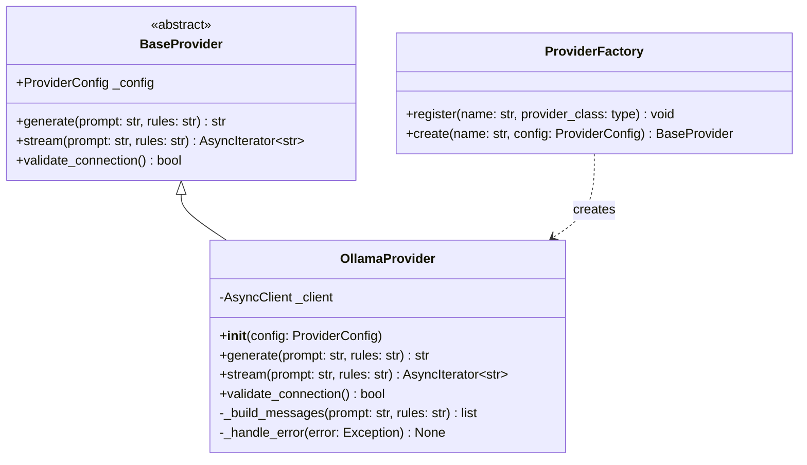

# Ollama Provider Implementation Plan

## Overview

Implement the Ollama provider client that integrates with the existing LLM abstraction layer for Sprint 3. This provider will enable Specify.AI to interact with local LLMs running via Ollama.

## Architecture



## Key Implementation Details

### 1. OllamaProvider Class Structure

**File**: `specify/providers/ollama.py`

```python
# Key imports
from ollama import AsyncClient
from specify.providers.base import (
    BaseProvider,
    ProviderConfig,
    ProviderConnectionError,
    ProviderResponseError,
)

class OllamaProvider(BaseProvider):
    """Ollama provider for local LLM inference."""

    def __init__(self, config: ProviderConfig) -> None:
        super().__init__(config)
        host = config.base_url or "http://localhost:11434"
        self._client = AsyncClient(host=host)
```

### 2. Method Implementations

#### generate(prompt, rules) -> str

- Build messages list with system message for rules and user message for prompt
- Call `await self._client.chat(model=..., messages=..., stream=False)`
- Extract and return `response['message']['content']`
- Handle errors and map to appropriate exceptions

#### stream(prompt, rules) -> AsyncIterator[str]

- Build messages list same as generate
- Call `await self._client.chat(model=..., messages=..., stream=True)`
- Iterate over chunks: `async for chunk in response:`
- Yield `chunk['message']['content']` for each chunk
- Handle errors and map to appropriate exceptions

#### validate_connection() -> bool

- Use `await self._client.list()` to check if Ollama is running
- Return True if successful
- Raise ProviderConnectionError on failure

### 3. Exception Mapping

| Ollama Error      | Provider Exception        |
| ----------------- | ------------------------- |
| Connection errors | `ProviderConnectionError` |
| Response errors   | `ProviderResponseError`   |
| Other errors      | `ProviderError`           |

### 4. Factory Registration

Register OllamaProvider with the default factory explicitly in the package `__init__.py`:

```python
# In specify/providers/__init__.py
from specify.providers.ollama import OllamaProvider

# Explicitly register providers with the default factory
# This ensures importing the submodule is side-effect-free
get_default_factory().register("ollama", OllamaProvider)
```

This pattern avoids import-time side effects when importing the submodule directly, following PEP 20: "Explicit is better than implicit". Tests can import `OllamaProvider` without triggering registration with the global factory, enabling better test isolation.

### 5. Module Exports

Update `specify/providers/__init__.py`:

```python
from specify.providers.ollama import OllamaProvider

__all__ = [
    # ... existing exports
    "OllamaProvider",
]
```

## Test Strategy

**File**: `tests/test_providers/test_ollama.py`

### Test Categories

1. **Initialization Tests**
   - Test default host configuration
   - Test custom host from config.base_url
   - Test model configuration

2. **generate() Tests**
   - Test successful generation with prompt and rules
   - Test generation with empty rules
   - Test connection error handling
   - Test response error handling

3. **stream() Tests**
   - Test successful streaming
   - Test multiple chunks
   - Test error during streaming

4. **validate_connection() Tests**
   - Test successful validation
   - Test connection failure

5. **Factory Registration Tests**
   - Test that OllamaProvider is registered on import
   - Test factory.create returns OllamaProvider instance

### Mocking Strategy

Use `unittest.mock.AsyncMock` and `pytest-mock` to mock the Ollama AsyncClient:

```python
@pytest.fixture
def mock_ollama_client(mocker):
    """Mock the Ollama AsyncClient."""
    mock = mocker.patch("ollama.AsyncClient")
    return mock.return_value
```

## Files to Create/Modify

| File                                  | Action | Description                   |
| ------------------------------------- | ------ | ----------------------------- |
| `specify/providers/ollama.py`         | Create | OllamaProvider implementation |
| `specify/providers/__init__.py`       | Modify | Export OllamaProvider         |
| `.env.template`                       | Modify | Add OLLAMA_HOST variable      |
| `tests/test_providers/test_ollama.py` | Create | Comprehensive unit tests      |

## Acceptance Criteria

- [ ] `specify/providers/ollama.py` contains OllamaProvider class inheriting from BaseProvider
- [ ] All three abstract methods implemented: generate(), stream(), validate_connection()
- [ ] `specify/providers/__init__.py` exports OllamaProvider and get_default_factory() registers it
- [ ] Unit tests in `tests/test_providers/test_ollama.py` with ≥85% coverage
- [ ] All tests pass: `pytest tests/test_providers/ -v --cov=specify/providers/ollama.py --cov-report=term-missing`
- [ ] Type checking passes: `mypy specify/providers/`

## Dependencies

- `ollama>=0.1.0` - Already in requirements.txt
- `pytest-asyncio>=0.23.0` - Already in requirements.txt
- `pytest-mock>=3.12.0` - Already in requirements.txt

## Anti-Scope

- DO NOT implement OpenAI or Anthropic clients (separate Sprint 8 task)
- DO NOT modify `specify/providers/base.py` - it's already complete
- DO NOT modify existing tests in `test_base.py`
- DO NOT create document generators
